# 00 · Mapa completo del sistema

> **Visión de extremo a extremo** de Lexora (interno **LegalFlow**), derivada del código en `main`.
> Recuentos verificables: **35 modelos · 21 enums · 34 módulos NestJS · 40 controladores · ~185
> endpoints · 30 tablas con RLS · 40 páginas Next.js · 7 rutas BFF**. Diagramas en Mermaid (renderizan
> en GitHub). Lo **diferido / no cableado** se marca explícitamente.
>
> Este documento es el índice visual; cada flujo enlaza al doc temático con el detalle.

---

## 1 · Mapa de dominios y módulos

Los **34 módulos NestJS** agrupados por dominio funcional. El color indica la capa.

```mermaid
flowchart TB
    subgraph CORE["⚙️ Plataforma transversal"]
        direction LR
        m_prisma["prisma · RLS"]
        m_storage["storage · cifrado"]
        m_realtime["realtime · Socket.IO"]
        m_compliance["compliance · fiscal"]
        m_app["app · guards/cron"]
    end

    subgraph IDENT["🔐 Identidad y acceso"]
        direction LR
        m_auth["auth · MFA/social"]
        m_users["users · staff/plazas"]
        m_platform["platform · super-admin"]
    end

    subgraph CRM["👥 Clientes y captación"]
        direction LR
        m_clients["clients · RGPD"]
        m_kyc["kyc · AML"]
        m_leads["leads · intake"]
    end

    subgraph CASE["📁 Expedientes"]
        direction LR
        m_matters["matters · timeline"]
        m_tasks["tasks · plazos"]
        m_messages["messages · chat"]
    end

    subgraph DOCS["📄 Documentos"]
        direction LR
        m_documents["documents · versiones"]
        m_templates["templates"]
        m_signatures["signatures · Signaturit"]
    end

    subgraph MONEY["💶 Económico y facturación"]
        direction LR
        m_ledger["ledger · costes/tiempo"]
        m_billing["billing · planes"]
        m_payments["payments · Stripe"]
        m_dunning["dunning · impagos"]
        m_retainer["retainer · provisión"]
        m_subscription["subscription · SaaS"]
    end

    subgraph PROD["🤖 Productividad e IA"]
        direction LR
        m_ai["ai · asistente/RAG"]
        m_search["search · global"]
        m_dashboard["dashboard"]
        m_reports["reports · fiscal"]
        m_calendar["calendar · iCal"]
        m_integrations["integrations · Google/MS"]
    end

    subgraph OPS["🛡️ Cumplimiento y operación"]
        direction LR
        m_audit["audit · append-only"]
        m_notifications["notifications"]
        m_settings["settings · certificado"]
        m_import["import · CSV"]
        m_health["health"]
    end

    classDef core fill:#e2e8f0,stroke:#475569,color:#1e293b
    classDef ident fill:#dbeafe,stroke:#3b82f6,color:#1e3a8a
    classDef crm fill:#dcfce7,stroke:#22c55e,color:#14532d
    classDef case fill:#fef9c3,stroke:#eab308,color:#713f12
    classDef docs fill:#ffedd5,stroke:#f97316,color:#7c2d12
    classDef money fill:#fee2e2,stroke:#ef4444,color:#7f1d1d
    classDef prod fill:#fae8ff,stroke:#d946ef,color:#701a75
    classDef ops fill:#f1f5f9,stroke:#94a3b8,color:#334155

    class m_prisma,m_storage,m_realtime,m_compliance,m_app core
    class m_auth,m_users,m_platform ident
    class m_clients,m_kyc,m_leads crm
    class m_matters,m_tasks,m_messages case
    class m_documents,m_templates,m_signatures docs
    class m_ledger,m_billing,m_payments,m_dunning,m_retainer,m_subscription money
    class m_ai,m_search,m_dashboard,m_reports,m_calendar,m_integrations prod
    class m_audit,m_notifications,m_settings,m_import,m_health ops
```

---

## 2 · Mapa de navegación (40 páginas Next.js)

Tres **scopes** mutuamente excluyentes (firm / client / platform) más las páginas públicas. El
`middleware.ts` redirige según sesión y scope.

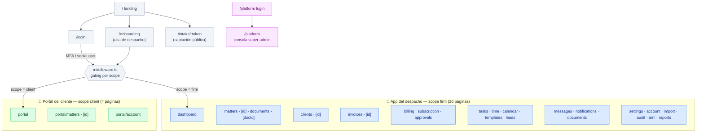

Detalle de rutas, layouts, BFF e i18n en [08-frontend-architecture.md](08-frontend-architecture.md).

---

## 3 · Diagrama de despliegue (producción)

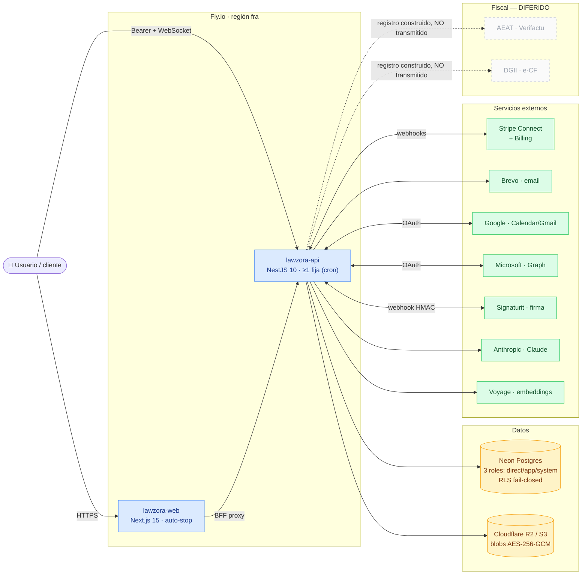

Pipeline CI/CD (9 jobs) e infraestructura en [09-infrastructure-cicd.md](09-infrastructure-cicd.md).

---

## 4 · Asistente IA y búsqueda semántica (RAG)

Provider **Anthropic** (`AI_MODEL`, por defecto `claude-opus-4-6`). Embeddings con **Voyage**.
Ambos **gateados**: sin `ANTHROPIC_API_KEY` / `VOYAGE_API_KEY` el motor responde `isEnabled()=false`
→ `503` y la UI oculta la feature (`GET /ai/status`). RAG sin pgvector: vectores `Float[]` en la tabla
`AiEmbedding` y **similitud coseno en la app**.

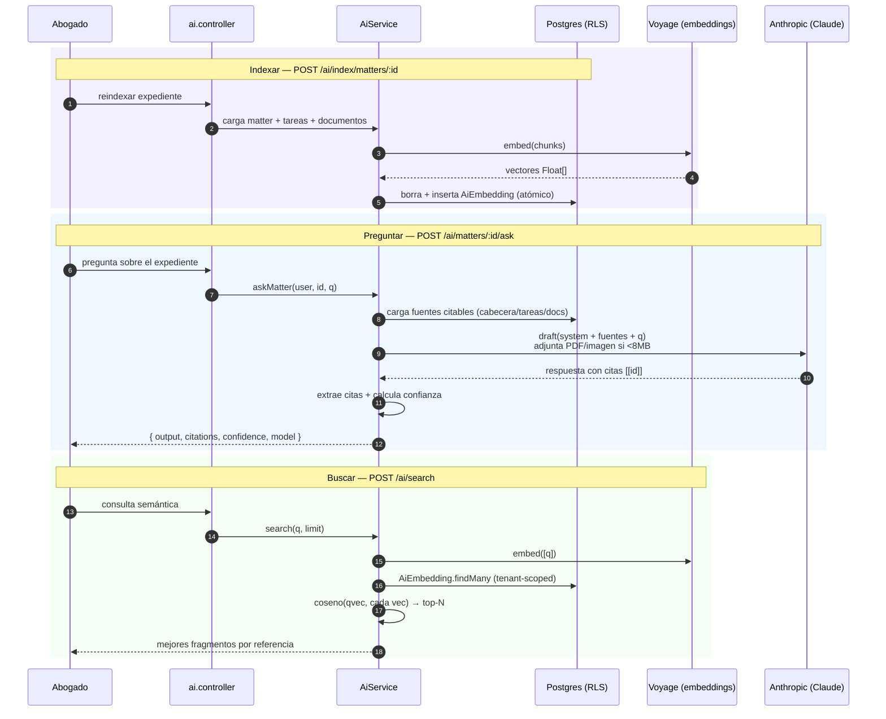

Features cableadas: **asistente anclado al expediente** (citado), **resumen de expediente**,
**resumen/extracción de documento**, **borrador desde plantilla**, **borrador de correo**, **búsqueda
semántica**. Contratos en `packages/domain/src/contracts/ai-assistant.ts`; implementación en
`apps/api/src/ai/`.

---

## 5 · Facturación: ledger → factura → cobro

El motor fiscal vive en `LedgerService.emitInvoiceInTx()`: bloqueo transaccional (`pg_advisory_xact_lock`)
sobre la serie, numeración sin huecos, encadenamiento `previousRecordHash` (Verifactu) y registro
fiscal vía `ComplianceProvider` por jurisdicción.

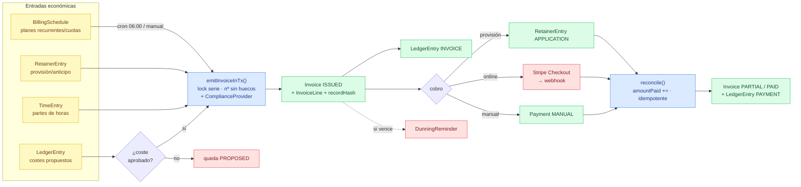

---

## 6 · Cobro online con Stripe (Connect)

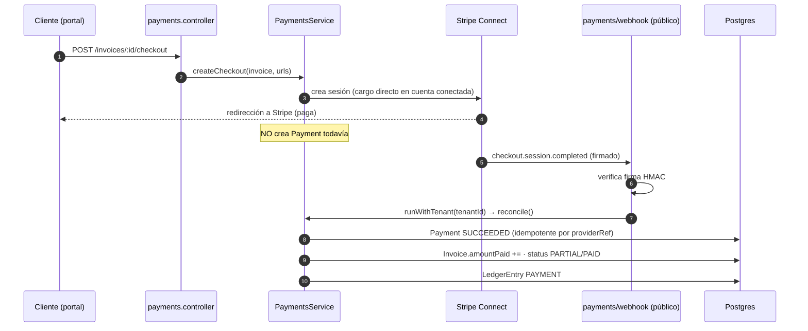

Onboarding Stripe Connect (`POST /payments/connect/onboard`) es solo **FIRM_ADMIN**. RD usa un **stub**
(Stripe no opera en RD). Detalle en [05-compliance-providers.md](05-compliance-providers.md).

---

## 7 · Dunning (recordatorios de impago)

Reglas escalonadas por jurisdicción (+1 `REMINDER`, +7 `WARNING`, +15 `FINAL`). Cron diario 06:00 +
ejecución manual. Canal **IN_APP** cableado; **EMAIL/SMS** = fase 2 (se marcan `SKIPPED`). Idempotente
por `@@unique (tenantId, invoiceId, offsetDays)`.

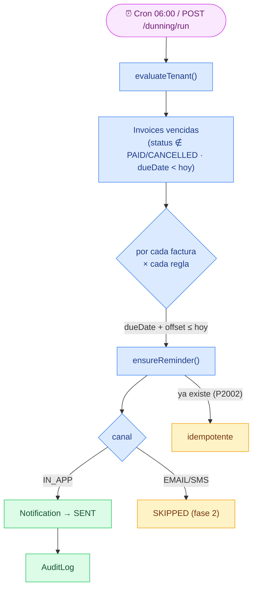

---

## 8 · Provisión de fondos (retainer)

Un `RetainerAccount` por expediente (saldo cacheado, transaccional con `SELECT … FOR UPDATE`).
Movimientos auditados en `RetainerEntry`.

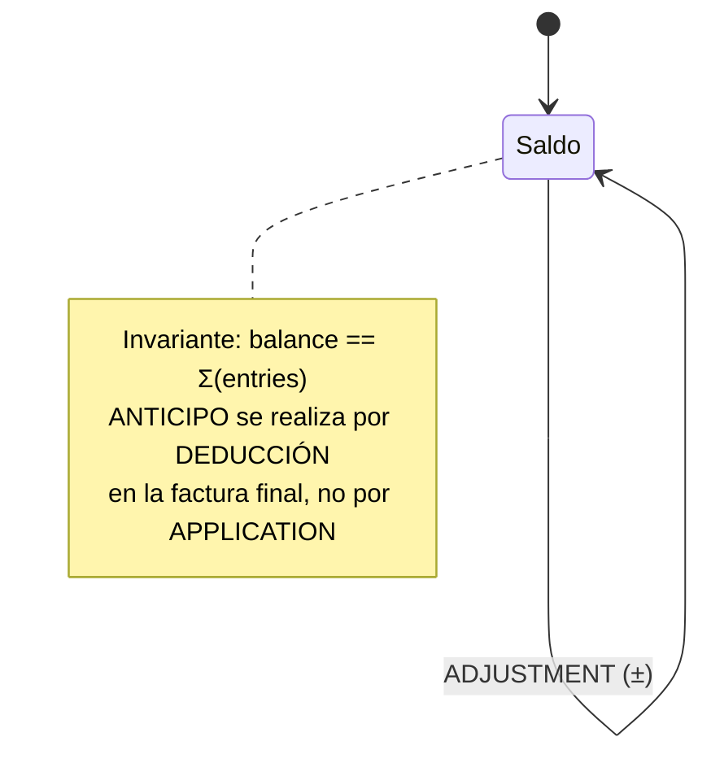

Flujos: `deposit`, `anticipo`, `apply`, `final-invoice` (deduce anticipos), `refund`. Ver
[05-compliance-providers.md](05-compliance-providers.md) y `retainer.controller`.

---

## 9 · Integraciones: OAuth + correo del expediente

Google y Microsoft. Tokens **cifrados en reposo** (AES-256-GCM) en `OAuthConnection`. `state` firmado
HMAC (CSRF). El callback corre con rol **system** (sin sesión). Correo proveedor-neutral vía
`MailService` → `MatterEmail` (idempotente por `gmailId`).

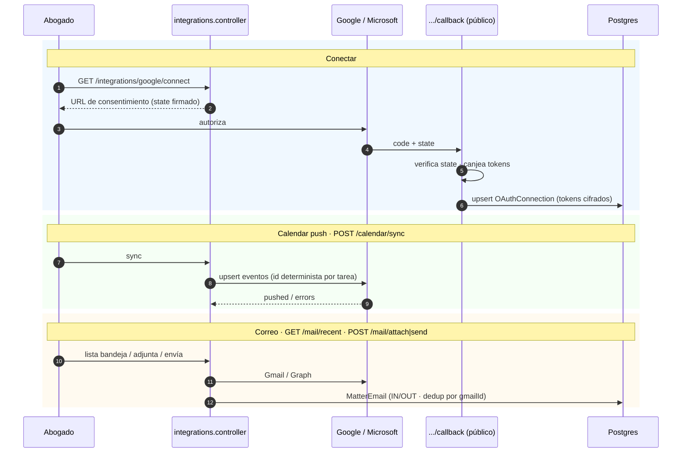

Detalle y setup en [GOOGLE_OAUTH_SETUP.md](../setup/GOOGLE_OAUTH_SETUP.md) /
[MICROSOFT_OAUTH_SETUP.md](../setup/MICROSOFT_OAUTH_SETUP.md).

---

## 10 · Suscripción SaaS del despacho

Cobro **por plaza** (FIRM*ADMIN + LAWYER activos), ciclo `MONTHLY`/`ANNUAL` (2 meses gratis), trial 14
días, cupo \_founder*. El acceso se gatea por interceptor; los endpoints de suscripción llevan
`@AllowExpired()` para poder reactivar.

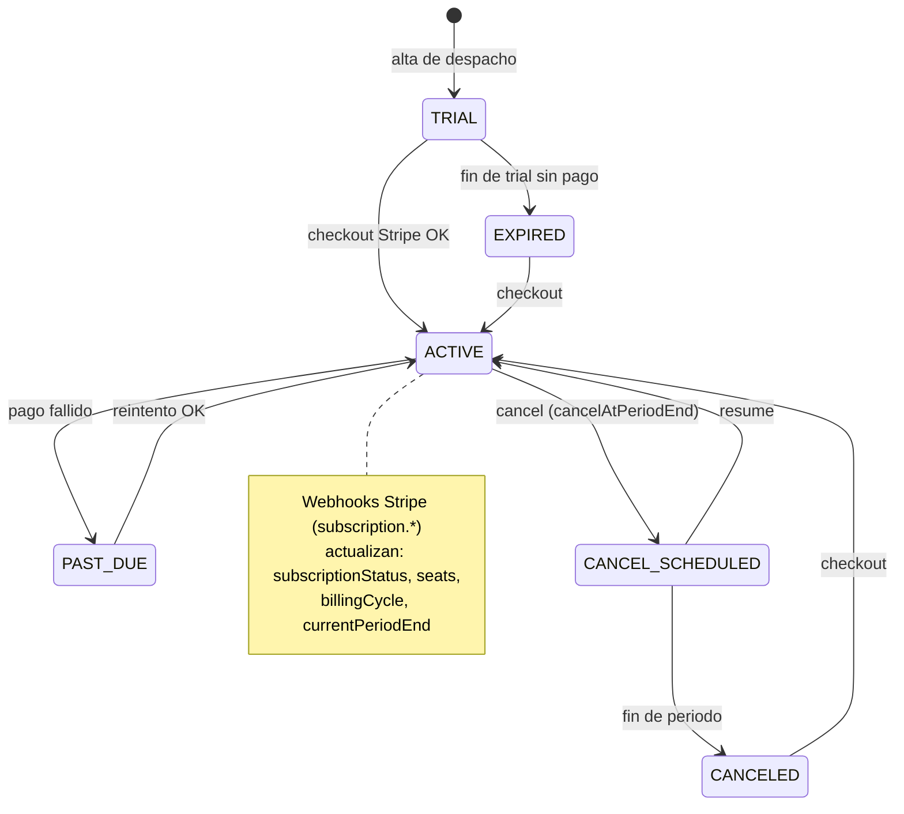

---

## 11 · Firma electrónica (Signaturit)

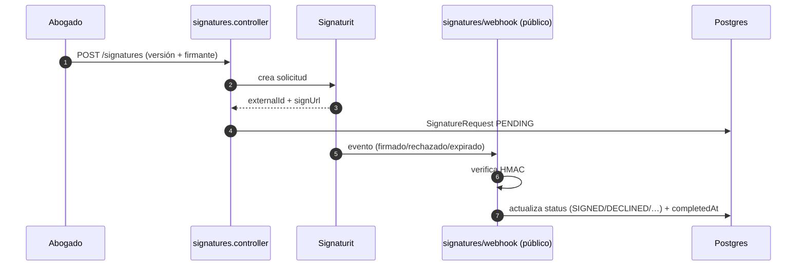

---

## 12 · Captación: lead → cliente

Formulario público de intake (`/api/public/intake/:token`, throttle 5/min/IP) o alta manual. La
conversión enlaza `Client` + `Matter`.

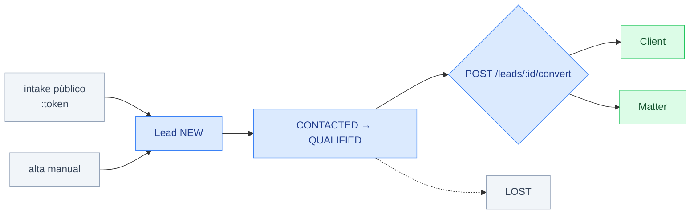

---

## 13 · Mapa de endpoints por dominio (~185)

| Dominio                          | Controladores                                                                                             | Endpoints |
| -------------------------------- | --------------------------------------------------------------------------------------------------------- | --------- |
| Auth e identidad                 | `auth`, `platform-auth`, `users`                                                                          | ~25       |
| Portal del cliente               | `portal`                                                                                                  | 12        |
| Clientes y KYC                   | `clients`, `kyc`                                                                                          | 13        |
| Expedientes                      | `matters`                                                                                                 | 8         |
| Documentos / plantillas / firmas | `documents`, `templates`, `signatures`, `signatures-webhook`                                              | 19        |
| Tareas y tiempo                  | `tasks`                                                                                                   | 8         |
| Económico                        | `ledger`, `payments`, `payments-webhook`, `dunning`, `retainer`, `billing`                                | 38        |
| Suscripción SaaS                 | `subscription`, `subscription-webhook`                                                                    | 10        |
| Notificaciones y mensajes        | `notifications`, `messages`                                                                               | 6         |
| Integraciones / calendar / mail  | `integrations`, `google-callback`, `microsoft`, `microsoft-callback`, `mail`, `calendar`, `calendar-feed` | 14        |
| IA y búsqueda                    | `ai`, `search`                                                                                            | 10        |
| Leads e intake                   | `leads`, `intake`                                                                                         | 10        |
| Plataforma / admin               | `platform`                                                                                                | 5         |
| Reports / dashboard / audit      | `reports`, `dashboard`, `audit`                                                                           | 5         |
| Ajustes e importación            | `settings`, `import`                                                                                      | 6         |
| Salud                            | `health`                                                                                                  | 1         |

Tabla exhaustiva (método · ruta · roles) en [07-api-reference.md](07-api-reference.md).

---

Enlazado desde [README de arquitectura](README.md). Para los cimientos transversales (auth, RLS,
cifrado, realtime) ver docs [02](02-auth-and-sessions.md)–[04](04-encryption-and-secrets.md).
