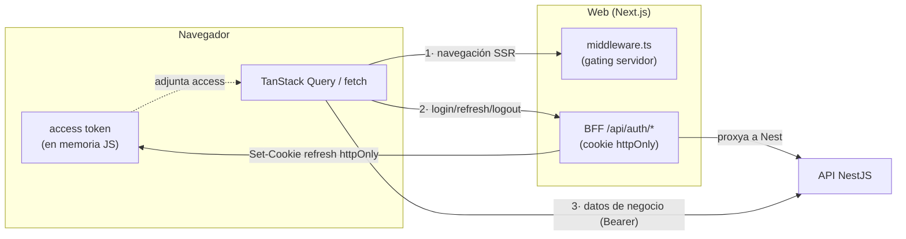
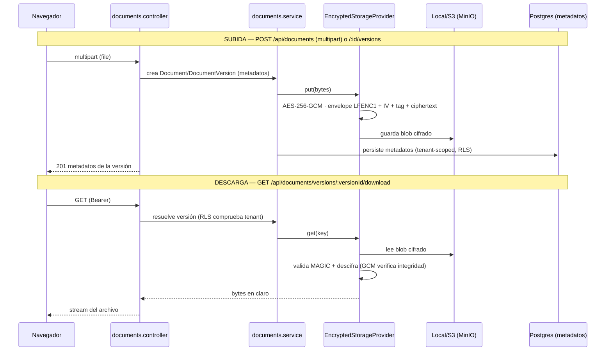
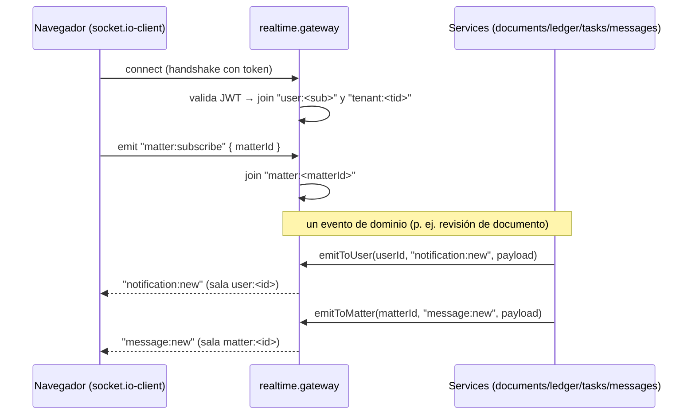

# 01 · Flujo de datos de extremo a extremo

> Cómo viaja una petición desde el navegador hasta Postgres y vuelta, con el contexto de tenant
> fijado. Incluye los caminos de **documentos** (subida/descarga cifrada) y **tiempo real**.
> ADRs relacionados: D-013/D-020 (RLS), D-019 (BFF), D-021 (cifrado).

## Petición autenticada típica (lectura de datos de negocio)

```mermaid
sequenceDiagram
    participant B as Navegador (React + TanStack Query)
    participant API as NestJS API (:4000/api)
    participant TG as ThrottlerGuard
    participant JG as JwtAuthGuard
    participant RG as RolesGuard
    participant IC as TenantContextInterceptor
    participant P as PrismaService (rol app)
    participant PG as PostgreSQL (RLS)

    B->>API: GET /api/matters  (Authorization: Bearer <access>)
    API->>TG: cadena de guards global
    TG->>JG: rate-limit OK
    JG->>JG: valida JWT (firma + exp). Si @Public → exime
    JG->>RG: req.user = { userId, tenantId, roles, scope }
    RG->>RG: ¿@Roles satisfecho? (FIRM_ADMIN/LAWYER/CLIENT)
    RG->>IC: autorizado
    IC->>IC: fija el contexto de tenant (AsyncLocalStorage)
    IC->>P: controller → service → prisma.matter.findMany()
    P->>PG: BEGIN; SELECT set_config('app.tenant_id', <tenantId>, true)
    P->>PG: SELECT ... FROM "Matter"  (RLS filtra por app.tenant_id)
    PG-->>P: solo filas del tenant (sin contexto → 0 filas)
    P-->>API: COMMIT; resultados
    API-->>B: 200 JSON
```

**Claves del camino:**

1. **Prefijo global** `api` (`app.setGlobalPrefix('api')` en `main.ts`) + `helmet()` + CORS por
   `CORS_ORIGINS`.
2. **Cadena de guards global** (registrada como `APP_GUARD`): `ThrottlerGuard` (app.module) →
   `JwtAuthGuard` → `RolesGuard` (auth.module). `@Public()` exime del JWT; `@Roles(...)` restringe.
3. **Contexto de tenant**: el `TenantContextInterceptor` (`APP_INTERCEPTOR`) toma `tenantId` del JWT y
   lo deja disponible; `PrismaService` envuelve cada operación de modelo en una transacción que
   ejecuta `set_config('app.tenant_id', <tenantId>, true)` (GUC **transaction-local**). Ver
   [03-multitenancy-and-rls.md](03-multitenancy-and-rls.md).
4. **Fail-closed**: sin `app.tenant_id` fijado, las políticas RLS devuelven **0 filas** (no error).

## El BFF y los dos caminos del cliente

El web expone un **BFF** propio (`apps/web/src/app/api/auth/*`) que es el **único** que toca la cookie
de sesión httpOnly. El resto de datos los pide el navegador **directamente** a la API con el access
token en memoria.



- **Camino 1 (navegación):** el `middleware.ts` lee la cookie de sesión en el servidor y redirige
  según haya sesión y scope (firm → `/dashboard`, client → `/portal`).
- **Camino 2 (auth):** `login`/`refresh`/`logout`/`register-tenant` van al **BFF**, que proxya a Nest y
  gestiona la cookie `lf_session` (refresh, httpOnly). El **access** vuelve al cliente y vive en memoria.
- **Camino 3 (negocio):** todo lo demás (matters, clients, ledger…) lo llama el cliente directo a la
  API con `Authorization: Bearer`. Ver [02-auth-and-sessions.md](02-auth-and-sessions.md).

## Subida y descarga de documentos (cifrado en reposo)



- El **contenido** del documento se cifra a nivel de aplicación con `EncryptedStorageProvider`
  (AES-256-GCM) **antes** de tocar el backend de objetos; los **metadatos** (nombre, versión, estado de
  revisión) viven en Postgres y están protegidos por RLS. Ver [04-encryption-and-secrets.md](04-encryption-and-secrets.md).
- Si no hay `DATA_ENCRYPTION_KEY`, el cifrado se **desactiva** (modo desarrollo); en producción es
  **obligatorio** (arranque falla sin clave).

## Tiempo real (Socket.IO)



- El gateway (`@WebSocketGateway`, CORS con credenciales) une cada socket a las salas `user:<sub>` y
  `tenant:<tid>` derivadas del JWT, y a `matter:<id>` bajo demanda (`matter:subscribe`).
- Eventos emitidos por el dominio: **`notification:new`** (centro de notificaciones y campana) y
  **`message:new`** (chat por expediente). El frontend invalida las queries de TanStack al recibirlos.
