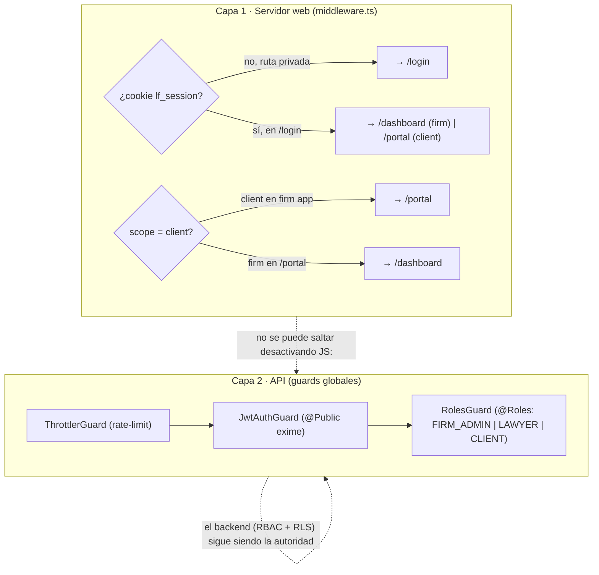

# 02 · Autenticación y sesiones (patrón BFF)

> Access token **en memoria** + refresh token en **cookie httpOnly** gestionada por el BFF de Next;
> **rotación** y **detección de reuso** en el servidor; cookie de **scope** (firm/client); gating de
> rol en el **middleware** (servidor) y en los **guards** de la API. ADRs: D-019 (BFF), D-012 (RBAC).

## Modelo de tokens

| Token           | Dónde vive                                      | Vida                      | Secreto                                          |
| --------------- | ----------------------------------------------- | ------------------------- | ------------------------------------------------ |
| **Access JWT**  | Memoria JS del cliente (`lib/api.ts`)           | corta (`JWT_ACCESS_TTL`)  | `JWT_ACCESS_SECRET`                              |
| **Refresh JWT** | Cookie httpOnly `lf_session` (BFF)              | larga (`JWT_REFRESH_TTL`) | `JWT_REFRESH_SECRET`                             |
| **Scope**       | Cookie httpOnly `lf_scope` (`firm` \| `client`) | con la sesión             | no secreto (httpOnly evita manipulación trivial) |

El refresh **nunca** se guarda en claro en BD: el modelo `RefreshToken` persiste solo `tokenHash`,
`expiresAt`, `revokedAt`. El JWT de refresh lleva un `jti` que identifica la fila.

## Login y uso (secuencia)

```mermaid
sequenceDiagram
    participant B as Navegador
    participant BFF as Next BFF /api/auth/*
    participant API as NestJS /api/auth
    participant DB as Postgres (RefreshToken)

    B->>BFF: POST /api/auth/login {email, password}
    BFF->>API: POST /api/auth/login (proxy)
    API->>DB: verifica credenciales (argon2) + emite par
    DB-->>API: refresh hasheado guardado
    API-->>BFF: { accessToken, refreshToken, scope }
    BFF-->>B: Set-Cookie lf_session (httpOnly) + lf_scope; body { accessToken }
    Note over B: access vive en memoria; refresh nunca lo ve el JS

    B->>API: GET /api/... (Authorization: Bearer access)
    API-->>B: 200 (o 401 si expiró)

    Note over B,DB: al expirar el access
    B->>BFF: POST /api/auth/refresh (cookie lf_session)
    BFF->>API: POST /api/auth/refresh { refreshToken de la cookie }
    API->>DB: rotate(): valida hash y revokedAt
    alt token válido
        DB-->>API: revoca el viejo, emite par nuevo
        API-->>BFF: { accessToken, refreshToken }
        BFF-->>B: Set-Cookie lf_session (nuevo) + body { accessToken }
    else token reusado o revocado
        DB-->>API: revoca TODA la familia del usuario
        API-->>BFF: 401 auth.refreshReused
        BFF-->>B: 401 (sesión muerta)
    end
```

## Rotación y detección de reuso (servidor)

Implementado en `auth/tokens.service.ts` (`rotate`):

1. Se descifra el refresh y se localiza la fila por `jti`.
2. Si la fila está **revocada** o el **hash no coincide** con el presentado → se trata como **reuso**:
   se **revocan todos** los refresh activos del usuario (`revokedAt = now` donde `userId = ... AND
revokedAt IS NULL`) y se lanza `auth.refreshReused`. Esto invalida la sesión robada y la legítima.
3. Si es válido → se **revoca el token presentado** y se **emite un par nuevo** (rotación).

`logout` revoca el refresh presentado (`revoke`). El cliente, además, descarta el access de memoria.

## Gating de rol — en dos capas



- **Capa 1 (UX, servidor):** `middleware.ts` redirige según sesión y scope. Es conveniencia y defensa
  en profundidad; **no** es la frontera de seguridad.
- **Capa 2 (autoridad):** los **guards globales** de la API deciden de verdad. Un `CLIENT` que llame a
  un endpoint de firma recibe **403** aunque manipule el cliente; y aunque pasara el rol, **RLS** en BD
  impediría ver filas de otro tenant. Ver [03-multitenancy-and-rls.md](03-multitenancy-and-rls.md).

## Roles del sistema (RBAC)

`Role.FIRM_ADMIN`, `Role.LAWYER`, `Role.CLIENT`. Distribución observada en los controladores
(ver [07-api-reference.md](07-api-reference.md)): **10** endpoints exigen `FIRM_ADMIN`, **6**
`FIRM_ADMIN|LAWYER` a nivel de método (además del gating de clase), **1** `CLIENT` (todo el `/portal`),
y **5** son `@Public` (`/health` y los 4 de `/auth` excepto `me`).

> **Nota de seguridad (D-019):** en producción la cookie de sesión añade `Secure` (solo HTTPS) y ya es
> `SameSite=Lax` + `httpOnly`. Ver [04-encryption-and-secrets.md](04-encryption-and-secrets.md) y
> [RUNBOOK §3](../../RUNBOOK.md).
