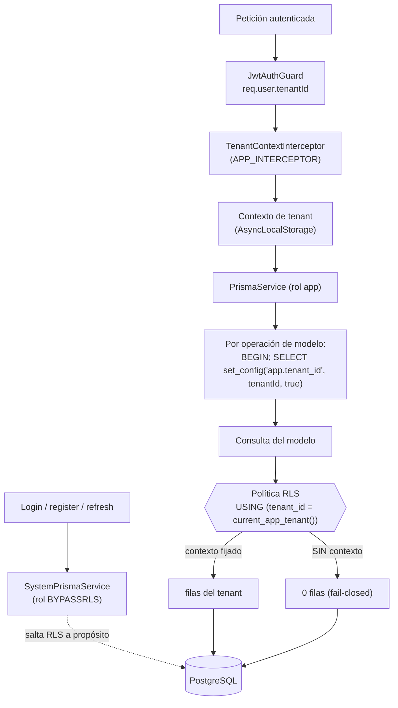

# 03 · Multi-tenancy y Row-Level Security (RLS) fail-closed

> Aislamiento por tenant aplicado **en la base de datos** con RLS **fail-closed**: sin contexto de
> tenant, cero filas. Tres roles de BD con privilegios distintos. ADRs: D-013, D-020 (RLS fail-closed).

## Los tres roles de base de datos

| Variable              | Rol Postgres       | Uso                                                            | Privilegio                                    |
| --------------------- | ------------------ | -------------------------------------------------------------- | --------------------------------------------- |
| `DATABASE_URL`        | `legalflow_app`    | **Runtime** de la API (`PrismaService`)                        | Mínimo (DML); **NOBYPASSRLS** → RLS se aplica |
| `DIRECT_DATABASE_URL` | propietario        | **Solo** Prisma Migrate (DDL, roles, políticas)                | Privilegiado                                  |
| `SYSTEM_DATABASE_URL` | `legalflow_system` | **Solo** login/registro/carga de token (`SystemPrismaService`) | **BYPASSRLS** (no superusuario)               |

- El runtime corre con el rol de **mínimo privilegio**; por eso RLS lo afecta. El rol de **sistema**
  (BYPASSRLS) es la **joya de la corona**: salta TODO el aislamiento y solo se usa en las rutas
  cross-tenant legítimas (autenticar a alguien antes de saber su tenant). Comportamiento real de
  `prisma.service.ts` (`SystemPrismaService`): en **producción** `SYSTEM_DATABASE_URL` es
  **obligatorio** — si falta, la API **lanza** y no arranca (sin fallback). **Fuera de producción**
  (dev), si falta, cae a `DIRECT_DATABASE_URL` con un **aviso** (comodidad de desarrollo).

## Cómo se propaga `app.tenant_id`

**Mecanismo (de `prisma.service.ts` y la migración `enable_rls`):**

1. La migración crea una función de ayuda inmutable que lee el GUC:
   `current_setting('app.tenant_id', true)` (el `true` evita error si no está fijado → devuelve NULL).
2. `PrismaService` (extensión de cliente) envuelve cada operación de modelo en una transacción que
   primero ejecuta `SELECT set_config('app.tenant_id', <tenantId>, true)`. El `true` final hace el GUC
   **transaction-local**: no se filtra entre peticiones de un pool compartido.
3. Si la operación ya corre dentro de una `tenantTransaction` (el GUC ya está fijado), no se vuelve a
   envolver.
4. Las **políticas RLS** filtran `USING (tenant_id = <contexto>)`. **Sin contexto → NULL → 0 filas.**

> Sutileza documentada en la migración: `app.tenant_id` es un GUC "placeholder" (con punto), válido
> sin declararlo en `postgresql.conf`.

## Estado RLS por modelo (16 con política / 4 sin)

| Modelo             | RLS | Motivo                                                                            |
| ------------------ | --- | --------------------------------------------------------------------------------- |
| Tenant             | ✅  | Raíz del tenant; política por `id = app.tenant_id` (añadida en `rls_fail_closed`) |
| User               | ✅  | tenant-scoped                                                                     |
| Role               | ✅  | tenant-scoped (roles por despacho)                                                |
| Client             | ✅  | tenant-scoped                                                                     |
| Matter             | ✅  | tenant-scoped                                                                     |
| Document           | ✅  | tenant-scoped                                                                     |
| DocumentVersion    | ✅  | tenant-scoped                                                                     |
| DocumentReview     | ✅  | tenant-scoped                                                                     |
| Task               | ✅  | tenant-scoped                                                                     |
| TimeEntry          | ✅  | tenant-scoped                                                                     |
| LedgerEntry        | ✅  | tenant-scoped                                                                     |
| Invoice            | ✅  | tenant-scoped (reforzada en `rls_fail_closed`)                                    |
| InvoiceLine        | ✅  | tenant-scoped (añadida en `rls_fail_closed`)                                      |
| Notification       | ✅  | tenant-scoped                                                                     |
| Message            | ✅  | tenant-scoped                                                                     |
| AuditLog           | ✅  | tenant-scoped (append-only)                                                       |
| **Permission**     | ❌  | **Catálogo RBAC global** (definiciones compartidas entre tenants)                 |
| **RolePermission** | ❌  | Join Role↔Permission del catálogo RBAC                                            |
| **UserRole**       | ❌  | Join User↔Role; el `Role` ya está RLS-scoped, no expone datos de negocio          |
| **RefreshToken**   | ❌  | Almacén de tokens; solo lo toca el rol **de sistema** (BYPASSRLS) en auth         |

- Las **14** primeras se activan en `20260614120000_enable_rls` (bucle `FOREACH` sobre un `text[]` de
  tablas: `ENABLE` + `FORCE ROW LEVEL SECURITY`). `Tenant` e `InvoiceLine` se añaden en
  `20260615120000_rls_fail_closed` → **16** en este bloque.
- Las **migraciones de cada feature posterior** añaden sus propias tablas tenant-scoped con la MISMA
  política `tenant_isolation` (`USING`/`WITH CHECK` por `app_current_tenant()`) y su e2e-RLS: `Payment`
  (payments), `DunningRule`/`DunningReminder` (dunning), `RetainerAccount`/`RetainerEntry` (retainer) y
  **`BillingSchedule`/`BillingInstallment`** (facturación programada, `20260616155957_billing_schedules`;
  e2e `billing-rls`).
- `FORCE ROW LEVEL SECURITY` hace que RLS aplique **incluso al propietario** de la tabla, cerrando la
  vía de escape por ownership.

## Por qué "fail-closed" importa

Un bug que olvide fijar el contexto **no filtra datos de otro tenant**: simplemente devuelve vacío
(degradación segura), en lugar del patrón "fail-open" donde olvidar un `WHERE tenant_id = ?` expone
todo. Es defensa en profundidad sobre el RBAC de la [capa de auth](02-auth-and-sessions.md): incluso
si un guard fallara, RLS seguiría aislando. Verificado por los e2e `rls`, `rls-wiring`,
`realtime-tenant-context` y `security` (ver [09-infrastructure-cicd.md](09-infrastructure-cicd.md)).
