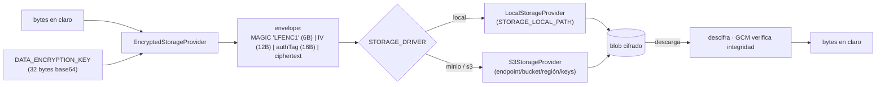
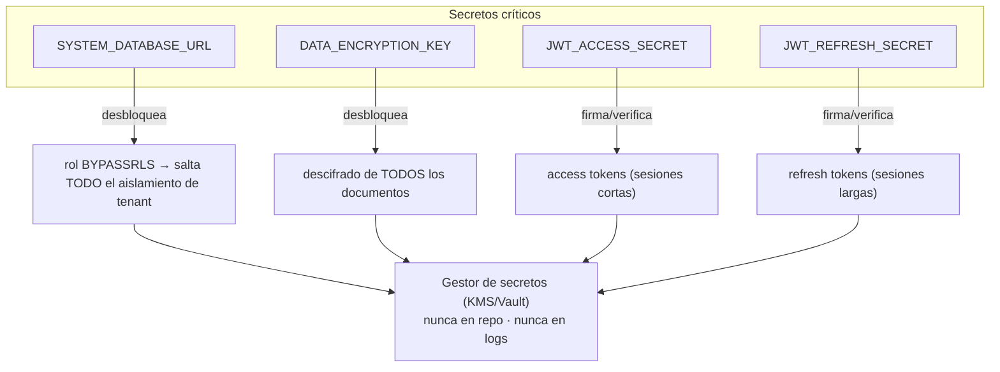

# 04 · Cifrado y secretos

> Cifrado **en tránsito** (TLS en el borde) y **en reposo** (contenido de documentos a nivel de app
> con AES-256-GCM; PII estructurada cubierta por cifrado de disco). Custodia de las **joyas de la
> corona**. ADRs: D-021 (cifrado en reposo), D-019/RUNBOOK (TLS, cookies).

> **Mensaje preciso (no sobre-vender):** "documentos cifrados a nivel de app + disco de la BD cifrado
> (infra)". NO "todo cifrado en reposo". La PII estructurada en Postgres la cubre el cifrado de disco
> del volumen, **no** cifrado de columna (diferido, D-021).

## Cifrado en tránsito

- **Terminación TLS en el borde** (reverse proxy / balanceador delante de `web` y `api`), con
  redirección 80→443 y **HSTS**. TLS 1.2+ (preferible 1.3). Ver [RUNBOOK §3](../../RUNBOOK.md).
- **Postgres**: `sslmode=require` (mejor `verify-full`) en las URLs de conexión en producción.
- **Cookies de sesión** (BFF): `httpOnly` + `SameSite=Lax` siempre; `Secure` (solo HTTPS) en
  producción. Ver [02-auth-and-sessions.md](02-auth-and-sessions.md).

## Cifrado en reposo del contenido de documentos

- **Algoritmo:** AES-256-GCM (`storage-crypto.ts`), envelope a nivel de aplicación, **agnóstico del
  backend** de objetos. Cabecera mágica `LFENC1` (6 bytes: marca + versión de formato) + IV (12B) +
  authTag (16B) + ciphertext. El GCM aporta **confidencialidad + integridad autenticada**.
- **Selección de backend:** `STORAGE_DRIVER` ∈ `local | minio | s3`. `EncryptedStorageProvider`
  envuelve al `LocalStorageProvider` o `S3StorageProvider`; el núcleo solo conoce la interfaz
  `StorageProvider`.
- **Clave ausente = cifrado desactivado** (desarrollo). En **producción es obligatoria**: si falta, el
  arranque **lanza** y la API no sube.
- **PII estructurada** (nombres, identificadores fiscales, etc.) **no** se cifra a columna: queda
  cubierta por el **cifrado de disco/volumen** (TDE del gestor). El cifrado de columna consultable
  (blind index/determinista) está **diferido** (D-021).

## Las joyas de la corona

| Secreto               | Qué desbloquea                                    | Dónde se usa                                               | Riesgo si se filtra                                     |
| --------------------- | ------------------------------------------------- | ---------------------------------------------------------- | ------------------------------------------------------- |
| `SYSTEM_DATABASE_URL` | Rol **BYPASSRLS**: salta el aislamiento de tenant | `SystemPrismaService` (solo login/registro/carga de token) | Lectura cross-tenant total                              |
| `DATA_ENCRYPTION_KEY` | Descifra **todos** los documentos                 | `EncryptedStorageProvider` / `storage-crypto.ts`           | Todos los documentos legibles; **perderla = perderlos** |
| `JWT_ACCESS_SECRET`   | Firma de access tokens                            | `JwtAuthGuard` / emisión                                   | Falsificación de sesiones cortas                        |
| `JWT_REFRESH_SECRET`  | Firma de refresh tokens                           | `tokens.service` (rotación)                                | Falsificación de sesiones largas                        |

**Custodia (RUNBOOK §1–2):** todos en **gestor de secretos** (AWS Secrets Manager / Vault), **nunca**
en el repositorio, **nunca** logueados. `legalflow_system` y los roles de BD se provisionan **fuera de
banda** en producción; la migración solo (re)aplica GRANTs.

> **Gap conocido (D-021):** hoy se usa **una sola** `DATA_ENCRYPTION_KEY` y **no hay re-cifrado**;
> rotarla dejaría **huérfanos** los blobs antiguos (el byte de versión del formato `LFENC1` está
> previsto para selección multi-clave futura). Hasta construir ese paso: tratar la clave como
> **longeva** y **no rotarla con datos reales**.
