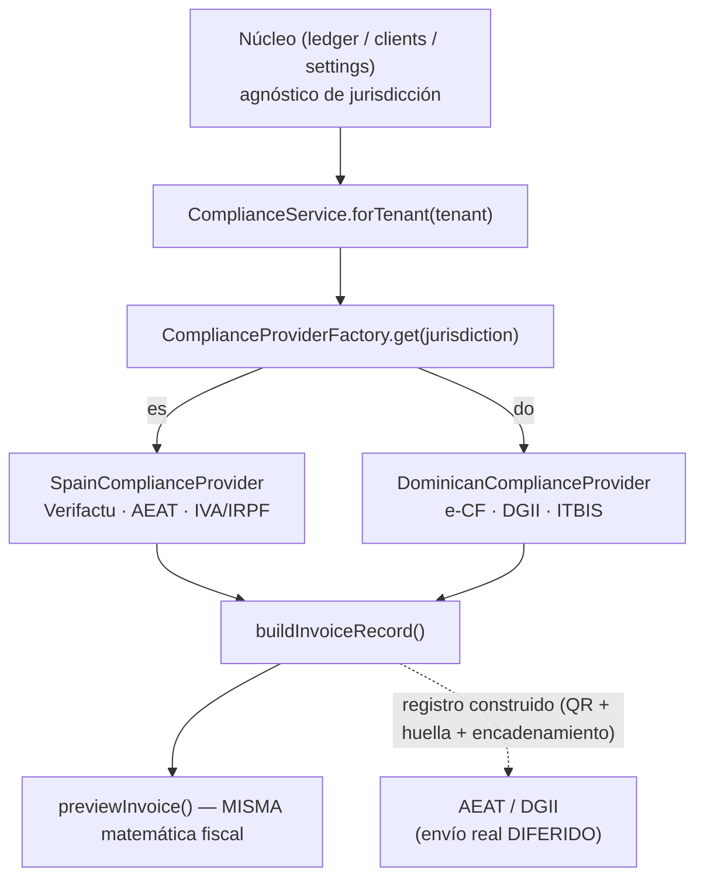
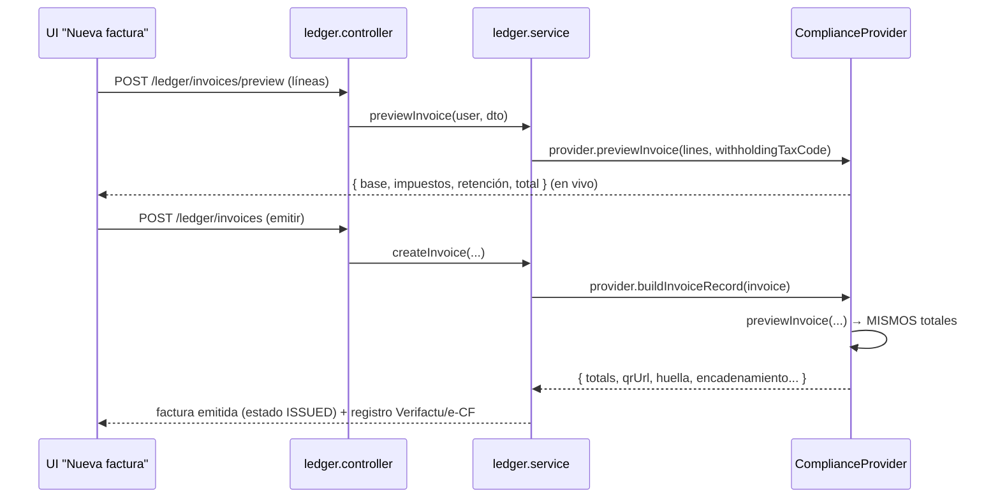

# 05 · Núcleo agnóstico + proveedores de cumplimiento

> El núcleo de negocio **no conoce** las reglas fiscales de cada país: las delega en un
> `ComplianceProvider` seleccionado por `tenant.jurisdiction`. Adaptadores: **España → Verifactu/AEAT**
> y **RD → e-CF/DGII**. ADRs: D-016 (compliance), D-022 (Verifactu/e-CF).

## La interfaz `ComplianceProvider` (7 métodos)

De `packages/compliance/src/provider.interface.ts`:

| Método                                       | Responsabilidad                                                                 | Estado                                     |
| -------------------------------------------- | ------------------------------------------------------------------------------- | ------------------------------------------ |
| `validateTaxId(id)`                          | Valida el identificador fiscal según jurisdicción (NIF/CIF/NIE · RNC/Cédula)    | ✅ activo                                  |
| `getTaxRates()`                              | Tipos impositivos (IVA/IRPF · ITBIS)                                            | ✅ activo                                  |
| `previewInvoice(lines, withholdingTaxCode?)` | **Cálculo fiscal** (base, impuestos, retención, total)                          | ✅ activo                                  |
| `buildInvoiceRecord(invoice)`                | Construye el **registro fiscal** (Verifactu / e-CF): QR, huella, encadenamiento | ✅ construye · ⛔ no transmite             |
| `getProceduralDeadlines(params)`             | Cómputo de **plazos procesales** por jurisdicción (con festivos)                | ✅ activo                                  |
| `getCourtIntegration()`                      | Integración con sedes judiciales                                                | ⛔ contrato (integración externa diferida) |
| `getFiscalReports()`                         | Informes fiscales (modelos/declaraciones)                                       | ⛔ contrato (diferido)                     |

## Selección por jurisdicción

- `ComplianceService` (`compliance.service.ts`) es el **único** punto del núcleo que obtiene un
  provider, vía `ComplianceProviderFactory.get(tenant.jurisdiction)`.
- Hay **2 implementaciones**: `SpainComplianceProvider` y `DominicanComplianceProvider`
  (`packages/compliance/src/providers/*`).

## Cálculo único: `buildInvoiceRecord` delega en `previewInvoice`

Para evitar divergencias entre el **preview en vivo** de la UI y la **emisión real**, ambos comparten
la misma matemática: cada provider implementa `previewInvoice(...)` y su `buildInvoiceRecord(invoice)`
**llama a `previewInvoice(invoice.lines, invoice.withholdingTaxCode)`** para obtener los totales antes
de construir el registro fiscal. Garantía verificada en `packages/compliance/src/invoicing.spec.ts`
("pre-cálculo read-only sin divergencia con la emisión real").

## Deducción de anticipos en la factura final (D-027 (b))

Al cerrar un asunto con anticipos ya facturados (R2b), la **factura final** factura el servicio completo
y **deduce** los anticipos con **líneas negativas** (espejo de la base+impuesto de cada anticipo). Así el
**impuesto acumulado** (anticipo + final) = impuesto del total, **sin doble imposición**; las facturas de
anticipo quedan **inmutables** (no es una rectificativa). `computeInvoiceTotals` ya opera con signo, así
que la matemática no cambia.

`InvoiceInput` incorpora `deductedAdvances?: { invoiceNumber, base, taxCode }[]` para la **trazabilidad**
del registro fiscal (no interviene en los totales, que ya salen de las líneas):

- **ES (Verifactu):** bloque `anticiposDeducidos` en el payload con `{ numFactura, baseDeducida, impuesto }`.
- **RD (e-CF):** bloque `<AnticiposDeducidos><Anticipo><eNCFAnticipo>…<MontoGravadoDeducido>…` en el XML
  del e-CF final (conservador; la deducción en el e-CF final está menos cerrada en las fuentes RD que la
  nota de crédito → afinable por un contador dominicano).

La orquestación (emisión + drawdown del saldo de anticipo, atómica) vive en
`RetainerService.invoiceFinalWithDeduction` (`POST /retainer/final-invoice`); ver D-027 · Notas de
implementación PR-R3b en `DECISIONS.md`. El **refund** de un anticipo (rectificativa) es R3c.

## Qué está cableado y qué no

| Aspecto                                                                              | Estado                                  |
| ------------------------------------------------------------------------------------ | --------------------------------------- |
| Validación fiscal (NIF/CIF/NIE/RNC/Cédula)                                           | ✅ activo                               |
| Cálculo IVA/IRPF (ES) · ITBIS (RD)                                                   | ✅ activo (matemática única)            |
| **Registro Verifactu** (QR cotejo AEAT + huella + encadenamiento de huella anterior) | ✅ **construido y persistido**          |
| **Registro e-CF** (formato DGII)                                                     | ✅ **construido**                       |
| **Envío/transmisión real a AEAT**                                                    | ⛔ **DIFERIDO** (no se llama a la sede) |
| **Envío/transmisión real a DGII**                                                    | ⛔ **DIFERIDO**                         |
| Plazos procesales (cómputo con festivos por jurisdicción)                            | ✅ activo (alimenta la Agenda)          |
| Integración con sedes judiciales / informes fiscales                                 | ⛔ contrato, sin implementar            |

> El detalle del registro Verifactu (QR escaneable, huella SHA-256, "huella anterior" para el
> encadenamiento) se renderiza en el detalle de factura del frontend. La pieza que falta para
> producción es el **transporte** a la administración, no el cálculo ni el formato.
