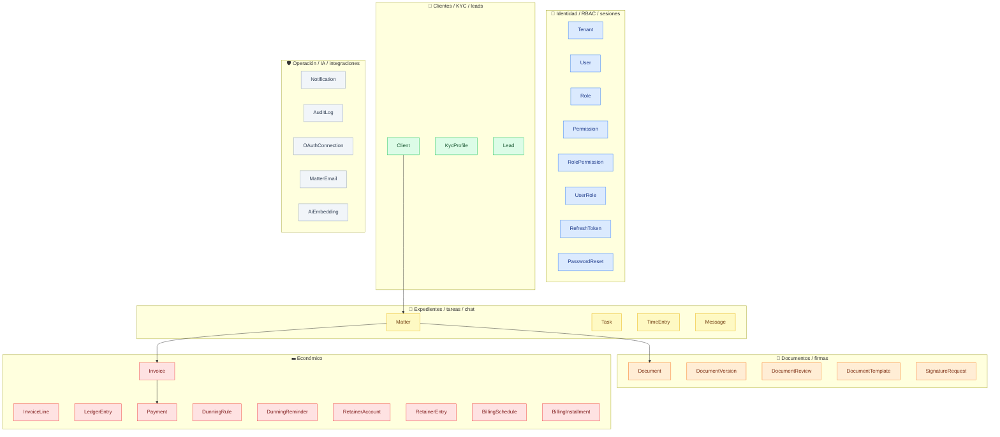
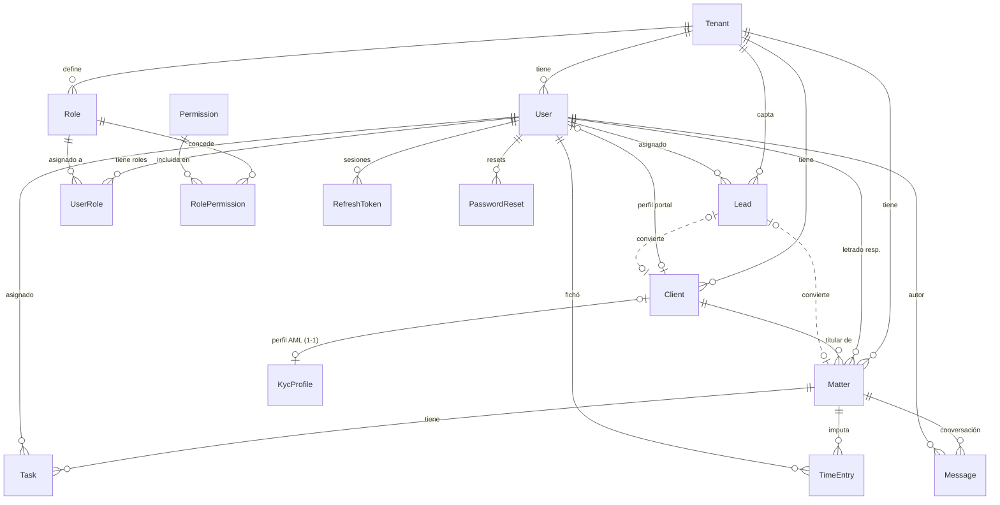
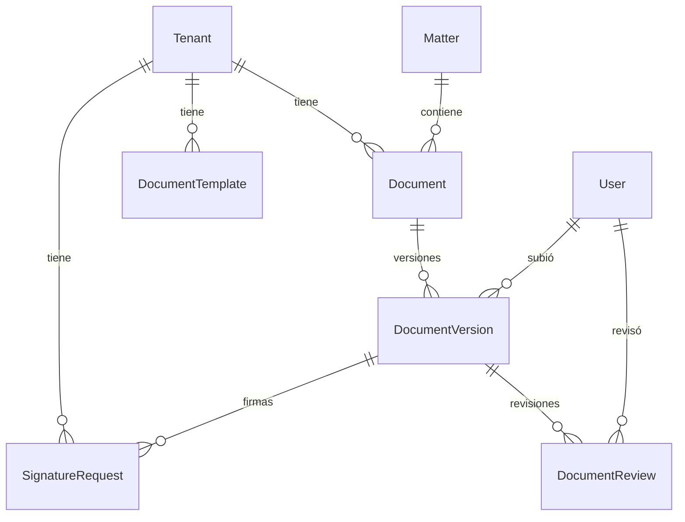
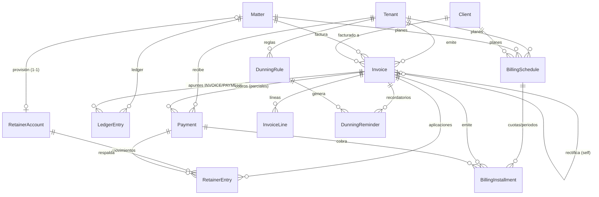
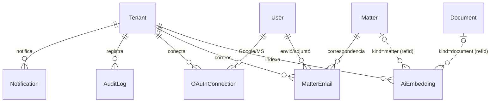

# 06 · Modelo de datos (ERD)

> Derivado de `apps/api/prisma/schema.prisma`: **35 modelos** + **21 enums**. El estado RLS por tabla
> está en [03-multitenancy-and-rls.md](03-multitenancy-and-rls.md) (**30 con política / 5 sin**). Cada
> modelo tenant-scoped cuelga de `Tenant` por `tenantId`.
>
> Para evitar un ERD ilegible de 35 cajas, el modelo se presenta como un **mapa de dominios** seguido de
> **ERDs por clúster**. La vista de extremo a extremo está en [00-mapa-completo.md](00-mapa-completo.md).

## Mapa de dominios

`Tenant` es la raíz de todo lo tenant-scoped; aquí se omiten sus aristas para no saturar el diagrama.

## ERD — Identidad, clientes y expedientes

## ERD — Documentos y firmas

## ERD — Económico (facturación, pagos, provisión, planes)

## ERD — Operación, IA e integraciones

## Modelos y campos clave

| Modelo                 | Campos clave (no exhaustivo)                                                                                                                                                                                                                                                                            | Relaciones                                                                             |
| ---------------------- | ------------------------------------------------------------------------------------------------------------------------------------------------------------------------------------------------------------------------------------------------------------------------------------------------------- | -------------------------------------------------------------------------------------- |
| **Tenant**             | `id`, `name`, `jurisdiction`, `currency`, `taxId`, `locale`, `plan`, `invoiceSeries`, `dataRegion`, `retentionMonths`, `certificate*`                                                                                                                                                                   | raíz de todo lo tenant-scoped                                                          |
| **User**               | `id`, `tenantId`, `email`, `passwordHash`, `fullName`                                                                                                                                                                                                                                                   | → roles (UserRole), perfil cliente, matters, tasks, versiones, tokens                  |
| **Role**               | `id`, `tenantId`, `code` (FIRM_ADMIN/LAWYER/CLIENT)                                                                                                                                                                                                                                                     | RolePermission, UserRole                                                               |
| **Permission**         | `id`, `code`                                                                                                                                                                                                                                                                                            | RolePermission (catálogo **global**, sin RLS)                                          |
| **RolePermission**     | `roleId`, `permissionId`                                                                                                                                                                                                                                                                                | join (sin RLS)                                                                         |
| **UserRole**           | `userId`, `roleId`                                                                                                                                                                                                                                                                                      | join (sin RLS)                                                                         |
| **RefreshToken**       | `id`(jti), `userId`, `tokenHash`, `expiresAt`, `revokedAt`                                                                                                                                                                                                                                              | sesiones; **sin RLS** (rol de sistema)                                                 |
| **Client**             | `id`, `tenantId`, `name`, `taxId`, `taxIdKind`, `email`, `phone`, `userId?`, `anonymizedAt?`, `dataRegion?`, `retentionMonths?`                                                                                                                                                                         | matters, invoices, usuario portal                                                      |
| **Matter**             | `id`, `tenantId`, `reference`, `title`, `type`, `status` (MatterStatus), `clientId`, `lawyerId?`, `openedAt`, `closedAt?`                                                                                                                                                                               | documentos, tareas, tiempo, ledger, facturas, mensajes                                 |
| **Document**           | `id`, `tenantId`, `matterId`, `name`                                                                                                                                                                                                                                                                    | versiones                                                                              |
| **DocumentVersion**    | `id`, `documentId`, `version`, `uploadedById`, `reviewStatus` (DocumentReviewStatus), `storageKey`, `size`                                                                                                                                                                                              | revisiones                                                                             |
| **DocumentReview**     | `id`, `versionId`, `reviewerId`, `status`, `comment?`                                                                                                                                                                                                                                                   | —                                                                                      |
| **Task**               | `id`, `tenantId`, `matterId?`, `assigneeId?`, `title`, `status` (TaskStatus), `dueDate?`                                                                                                                                                                                                                | —                                                                                      |
| **TimeEntry**          | `id`, `tenantId`, `matterId`, `userId`, `minutes`, `hourlyRate`, `workedAt`                                                                                                                                                                                                                             | alimenta el ledger                                                                     |
| **LedgerEntry**        | `id`, `tenantId`, `matterId`, `type` (LedgerEntryType), `amount`, `currency`, `invoiceId?`, `approvalStatus?`                                                                                                                                                                                           | apuntes (provisión, tiempo, factura, pago, costes)                                     |
| **Invoice**            | `id`, `tenantId`, `matterId`, `clientId`, `number`, `status` (InvoiceStatus), `issueDate`, `total`, `currency`, registro fiscal (qr/huella/encadenamiento), `documentType` (NORMAL/RECTIFICATIVA), `rectifiesInvoiceId?` (self-FK), `rectificationReason?`, `rectificationMode?`, `withholdingTaxCode?` | líneas, apuntes, rectificada/rectificativas (self-rel)                                 |
| **InvoiceLine**        | `id`, `invoiceId`, `description`, `quantity`, `unitPrice`, `taxCode`                                                                                                                                                                                                                                    | —                                                                                      |
| **DunningRule**        | `id`, `tenantId`, `offsetDays`, `severity` (DunningSeverity), `channel` (DunningChannel), `active`                                                                                                                                                                                                      | reglas de recordatorio por tenant (`@@unique tenantId,offsetDays`)                     |
| **DunningReminder**    | `id`, `tenantId`, `invoiceId`, `ruleId?`, `offsetDays`, `severity`, `channel`, `status` (DunningReminderStatus), `scheduledFor`, `sentAt?`                                                                                                                                                              | recordatorio por factura/etapa; idempotente (`@@unique tenantId,invoiceId,offsetDays`) |
| **RetainerAccount**    | `id`, `tenantId`, `matterId` (único, 1-1), `currency` (= moneda del tenant), `balance` (cacheado)                                                                                                                                                                                                       | provisión por expediente; saldo por cliente = Σ de sus asuntos (derivado)              |
| **RetainerEntry**      | `id`, `tenantId`, `accountId`, `type` (RetainerMovementType), `amount` (con signo, mono-moneda), `invoiceId?`, `paymentId?`                                                                                                                                                                             | movimiento auditado del saldo de provisión                                             |
| **BillingSchedule**    | `id`, `tenantId`, `matterId`, `clientId`, `currency`, `type` (BillingScheduleType), `fiscalMode` (BillingFiscalMode), `status`, `lines` (Json), `withholdingTaxCode?`, `intervalUnit?`/`intervalCount`/`occurrences?` (RECURRING), `installmentCount?` (INSTALLMENTS), `startDate`, `nextRunAt?`        | plan de facturación recurrente / fraccionada; cuotas (1-N)                             |
| **BillingInstallment** | `id`, `tenantId`, `scheduleId`, `sequence`, `dueDate`, `amount`, `status` (BillingInstallmentStatus), `invoiceId?`, `paymentId?`, `emittedAt?`, `paidAt?`                                                                                                                                               | cuota/periodo del plan; enlaza factura + cobro (`@@unique scheduleId,sequence`)        |
| **Payment**            | `id`, `tenantId`, `invoiceId`, `amount`, `currency`, `status` (PaymentStatus), `method` (MANUAL/STRIPE/RETAINER), `providerRef?` (idempotencia), `metadata?`, `paidAt?`                                                                                                                                 | cobros (parciales) de la factura; respalda RetainerEntry/BillingInstallment            |
| **KycProfile**         | `id`, `tenantId`, `clientId` (único, 1-1), `status`, `risk` (LOW/MEDIUM/HIGH), `isPep`, `identityVerified`, `sanctionsChecked`, `reviewedById?`, `reviewedAt?`                                                                                                                                          | perfil AML/KYC del cliente                                                             |
| **Lead**               | `id`, `tenantId`, `name`, `email?`, `phone?`, `source` (intake/manual/…), `status` (NEW…CONVERTED/LOST), `estimatedValue?`, `assignedToId?`, `convertedClientId?`, `convertedMatterId?`                                                                                                                 | mini-CRM; conversión enlaza Client + Matter                                            |
| **DocumentTemplate**   | `id`, `tenantId`, `name`, `description?`, `body` (con placeholders `{{}}`)                                                                                                                                                                                                                              | plantilla para generar documentos                                                      |
| **SignatureRequest**   | `id`, `tenantId`, `documentId`, `versionId`, `matterId`, `provider` (`signaturit`), `externalId?`, `status` (PENDING/SIGNED/DECLINED/EXPIRED/CANCELED), `signerName/Email`, `signUrl?`                                                                                                                  | solicitud de firma electrónica por versión                                             |
| **OAuthConnection**    | `id`, `tenantId`, `userId`, `provider` (`google`/`microsoft`), `externalEmail`, `scopes`, `accessToken` (cifrado), `refreshToken?` (cifrado), `expiresAt` (`@@unique userId,provider`)                                                                                                                  | conexión OAuth; tokens AES-256-GCM en reposo                                           |
| **MatterEmail**        | `id`, `tenantId`, `matterId`, `userId?`, `direction` (IN/OUT), `gmailId?` (dedup), `fromAddr`, `toAddr`, `subject?`, `snippet?`, `sentAt`                                                                                                                                                               | correspondencia del expediente (Gmail/Graph)                                           |
| **AiEmbedding**        | `id`, `tenantId`, `kind` (`matter`/`document`), `refId`, `refLabel?`, `chunkIndex`, `content`, `embedding` (`Float[]`), `model`                                                                                                                                                                         | índice semántico RAG; similitud coseno en la app (sin pgvector)                        |
| **PasswordReset**      | `id`, `userId`, `tokenHash` (único), `expiresAt`, `usedAt?`, `createdById?`                                                                                                                                                                                                                             | token de reset de un solo uso; **sin RLS**                                             |
| **Notification**       | `id`, `tenantId`, `userId`, `type`, `title`, `body?`, `data?`, `readAt?`                                                                                                                                                                                                                                | destinatario                                                                           |
| **Message**            | `id`, `tenantId`, `matterId`, `authorId`, `body`                                                                                                                                                                                                                                                        | chat por expediente                                                                    |
| **AuditLog**           | `id`, `tenantId`, `actorId?`, `action`, `entityType`, `entityId`, `metadata?`, `ip?`, `createdAt`                                                                                                                                                                                                       | append-only                                                                            |

## Enumerados

| Enum                       | Valores                                                                                         |
| -------------------------- | ----------------------------------------------------------------------------------------------- |
| `Jurisdiction`             | `es`, `do`                                                                                      |
| `Currency`                 | `EUR`, `USD`, `DOP`                                                                             |
| `MatterStatus`             | `OPEN`, `IN_PROGRESS`, `ON_HOLD`, `CLOSED`, `ARCHIVED`                                          |
| `DocumentReviewStatus`     | `PENDING`, `IN_REVIEW`, `APPROVED`, `REJECTED`, `CHANGES_REQUESTED`                             |
| `TaskStatus`               | `TODO`, `IN_PROGRESS`, `DONE`, `CANCELLED`                                                      |
| `LedgerEntryType`          | `PROVISION`, `DISBURSEMENT`, `TIME_FEE`, `FEE`, `INVOICE`, `PAYMENT`, `ADJUSTMENT`              |
| `InvoiceStatus`            | `DRAFT`, `ISSUED`, `SENT`, `PARTIAL`, `OVERDUE`, `PAID`, `CANCELLED`                            |
| `InvoiceDocumentType`      | `NORMAL`, `RECTIFICATIVA` (rectificativa del refund de un anticipo, D-027 (c))                  |
| `RectificationMode`        | `SUSTITUCION` (implementado), `DIFERENCIAS` (reservado, refund parcial)                         |
| `ApprovalStatus`           | `PROPOSED`, `APPROVED`, `REJECTED` (por defecto `APPROVED`; un coste propuesto nace `PROPOSED`) |
| `PaymentStatus`            | `PENDING`, `SUCCEEDED`, `FAILED`                                                                |
| `ProvisionKind`            | `ANTICIPO`, `SUPLIDO`, `GENERICO` (clase del `DEPOSIT` de provisión)                            |
| `DunningChannel`           | `IN_APP`, `EMAIL`, `SMS` (hoy solo `IN_APP`; EMAIL/SMS = integración Fase 2)                    |
| `DunningSeverity`          | `REMINDER`, `WARNING`, `FINAL` (escalado del aviso)                                             |
| `DunningReminderStatus`    | `SCHEDULED`, `SENT`, `SKIPPED`, `FAILED`                                                        |
| `RetainerMovementType`     | `DEPOSIT` (+), `APPLICATION` (−), `REFUND` (−), `ADJUSTMENT` (±)                                |
| `BillingScheduleType`      | `RECURRING` (iguala → factura/periodo), `INSTALLMENTS` (fraccionar un importe)                  |
| `BillingFiscalMode`        | `SERVICE_RENDERED` (1 factura + cuotas-cobro), `ADVANCE` (factura de anticipo por cuota)        |
| `BillingInterval`          | `WEEKLY`, `MONTHLY`, `QUARTERLY`, `YEARLY`                                                      |
| `BillingScheduleStatus`    | `ACTIVE`, `PAUSED`, `COMPLETED`, `CANCELLED`                                                    |
| `BillingInstallmentStatus` | `SCHEDULED`, `EMITTED`, `PAID`, `SKIPPED`, `FAILED`                                             |

Valores confirmados contra `schema.prisma` (35 modelos · 21 enums).

## Notas de integridad

- Todas las tablas tenant-scoped llevan `tenantId` y dependen de él para RLS.
- `RefreshToken` se relaciona con `User` con `onDelete: Cascade`.
- Unicidades observadas: `User (tenantId, email)`, `Role (tenantId, code)`, `Matter (tenantId,
reference)`, `Invoice (tenantId, number)` — garantizan numeración y claves únicas **por tenant**.
