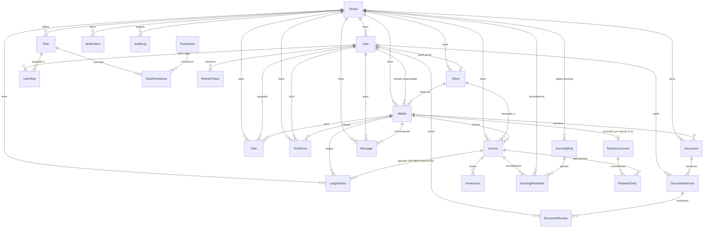

# 06 · Modelo de datos (ERD)

> Derivado de `apps/api/prisma/schema.prisma`: **20 modelos** + **8 enums**. El estado RLS por tabla
> está en [03-multitenancy-and-rls.md](03-multitenancy-and-rls.md) (16 con política / 4 sin). Cada
> modelo tenant-scoped cuelga de `Tenant` por `tenantId`.

## Diagrama entidad-relación

## Modelos y campos clave

| Modelo              | Campos clave (no exhaustivo)                                                                                                                               | Relaciones                                                                             |
| ------------------- | ---------------------------------------------------------------------------------------------------------------------------------------------------------- | -------------------------------------------------------------------------------------- |
| **Tenant**          | `id`, `name`, `jurisdiction`, `currency`, `taxId`, `locale`, `plan`, `invoiceSeries`, `dataRegion`, `retentionMonths`, `certificate*`                      | raíz de todo lo tenant-scoped                                                          |
| **User**            | `id`, `tenantId`, `email`, `passwordHash`, `fullName`                                                                                                      | → roles (UserRole), perfil cliente, matters, tasks, versiones, tokens                  |
| **Role**            | `id`, `tenantId`, `code` (FIRM_ADMIN/LAWYER/CLIENT)                                                                                                        | RolePermission, UserRole                                                               |
| **Permission**      | `id`, `code`                                                                                                                                               | RolePermission (catálogo **global**, sin RLS)                                          |
| **RolePermission**  | `roleId`, `permissionId`                                                                                                                                   | join (sin RLS)                                                                         |
| **UserRole**        | `userId`, `roleId`                                                                                                                                         | join (sin RLS)                                                                         |
| **RefreshToken**    | `id`(jti), `userId`, `tokenHash`, `expiresAt`, `revokedAt`                                                                                                 | sesiones; **sin RLS** (rol de sistema)                                                 |
| **Client**          | `id`, `tenantId`, `name`, `taxId`, `taxIdKind`, `email`, `phone`, `userId?`, `anonymizedAt?`, `dataRegion?`, `retentionMonths?`                            | matters, invoices, usuario portal                                                      |
| **Matter**          | `id`, `tenantId`, `reference`, `title`, `type`, `status` (MatterStatus), `clientId`, `lawyerId?`, `openedAt`, `closedAt?`                                  | documentos, tareas, tiempo, ledger, facturas, mensajes                                 |
| **Document**        | `id`, `tenantId`, `matterId`, `name`                                                                                                                       | versiones                                                                              |
| **DocumentVersion** | `id`, `documentId`, `version`, `uploadedById`, `reviewStatus` (DocumentReviewStatus), `storageKey`, `size`                                                 | revisiones                                                                             |
| **DocumentReview**  | `id`, `versionId`, `reviewerId`, `status`, `comment?`                                                                                                      | —                                                                                      |
| **Task**            | `id`, `tenantId`, `matterId?`, `assigneeId?`, `title`, `status` (TaskStatus), `dueDate?`                                                                   | —                                                                                      |
| **TimeEntry**       | `id`, `tenantId`, `matterId`, `userId`, `minutes`, `hourlyRate`, `workedAt`                                                                                | alimenta el ledger                                                                     |
| **LedgerEntry**     | `id`, `tenantId`, `matterId`, `type` (LedgerEntryType), `amount`, `currency`, `invoiceId?`, `approvalStatus?`                                              | apuntes (provisión, tiempo, factura, pago, costes)                                     |
| **Invoice**         | `id`, `tenantId`, `matterId`, `clientId`, `number`, `status` (InvoiceStatus), `issueDate`, `total`, `currency`, registro fiscal (qr/huella/encadenamiento) | líneas, apuntes                                                                        |
| **InvoiceLine**     | `id`, `invoiceId`, `description`, `quantity`, `unitPrice`, `taxCode`                                                                                       | —                                                                                      |
| **DunningRule**     | `id`, `tenantId`, `offsetDays`, `severity` (DunningSeverity), `channel` (DunningChannel), `active`                                                         | reglas de recordatorio por tenant (`@@unique tenantId,offsetDays`)                     |
| **DunningReminder** | `id`, `tenantId`, `invoiceId`, `ruleId?`, `offsetDays`, `severity`, `channel`, `status` (DunningReminderStatus), `scheduledFor`, `sentAt?`                 | recordatorio por factura/etapa; idempotente (`@@unique tenantId,invoiceId,offsetDays`) |
| **RetainerAccount** | `id`, `tenantId`, `matterId` (único, 1-1), `currency` (= moneda del tenant), `balance` (cacheado)                                                          | provisión por expediente; saldo por cliente = Σ de sus asuntos (derivado)              |
| **RetainerEntry**   | `id`, `tenantId`, `accountId`, `type` (RetainerMovementType), `amount` (con signo, mono-moneda), `invoiceId?`, `paymentId?`                                | movimiento auditado del saldo de provisión                                             |
| **Notification**    | `id`, `tenantId`, `userId`, `type`, `title`, `body?`, `data?`, `readAt?`                                                                                   | destinatario                                                                           |
| **Message**         | `id`, `tenantId`, `matterId`, `authorId`, `body`                                                                                                           | chat por expediente                                                                    |
| **AuditLog**        | `id`, `tenantId`, `actorId?`, `action`, `entity`, `entityId`, `createdAt`                                                                                  | append-only                                                                            |

## Enumerados

| Enum                    | Valores                                                                                         |
| ----------------------- | ----------------------------------------------------------------------------------------------- |
| `Jurisdiction`          | `es`, `do`                                                                                      |
| `Currency`              | `EUR`, `DOP`                                                                                    |
| `MatterStatus`          | `OPEN`, `IN_PROGRESS`, `ON_HOLD`, `CLOSED`, `ARCHIVED`                                          |
| `DocumentReviewStatus`  | `PENDING`, `IN_REVIEW`, `APPROVED`, `REJECTED`, `CHANGES_REQUESTED`                             |
| `TaskStatus`            | `TODO`, `IN_PROGRESS`, `DONE`, `CANCELLED`                                                      |
| `LedgerEntryType`       | `PROVISION`, `DISBURSEMENT`, `TIME_FEE`, `FEE`, `INVOICE`, `PAYMENT`, `ADJUSTMENT`              |
| `InvoiceStatus`         | `DRAFT`, `ISSUED`, `SENT`, `PAID`, `CANCELLED`                                                  |
| `ApprovalStatus`        | `PROPOSED`, `APPROVED`, `REJECTED` (por defecto `APPROVED`; un coste propuesto nace `PROPOSED`) |
| `DunningChannel`        | `IN_APP`, `EMAIL`, `SMS` (hoy solo `IN_APP`; EMAIL/SMS = integración Fase 2)                    |
| `DunningSeverity`       | `REMINDER`, `WARNING`, `FINAL` (escalado del aviso)                                             |
| `DunningReminderStatus` | `SCHEDULED`, `SENT`, `SKIPPED`, `FAILED`                                                        |
| `RetainerMovementType`  | `DEPOSIT` (+), `APPLICATION` (−), `REFUND` (−), `ADJUSTMENT` (±)                                |

Valores confirmados contra `schema.prisma`. (Nota: la tabla de modelos no es exhaustiva — `Payment` y
los enums `PaymentStatus`/`PaymentMethod` viven en el módulo de cobro; ver D-024.)

## Notas de integridad

- Todas las tablas tenant-scoped llevan `tenantId` y dependen de él para RLS.
- `RefreshToken` se relaciona con `User` con `onDelete: Cascade`.
- Unicidades observadas: `User (tenantId, email)`, `Role (tenantId, code)`, `Matter (tenantId,
reference)`, `Invoice (tenantId, number)` — garantizan numeración y claves únicas **por tenant**.
