# 07 · Referencia de la API (mapa de responsabilidades)

> **Los 185 endpoints**, ninguno fuera. Prefijo global `api`. Cadena de guards global:
> `ThrottlerGuard → JwtAuthGuard (@Public exime) → RolesGuard`. El **rol efectivo** combina el `@Roles`
> de clase con el de método (el más restrictivo gana). RLS aísla por tenant aunque el rol pase.
> Derivado de `apps/api/src/**/*.controller.ts` (40 controladores).
>
> Convenciones de la columna **Rol**: `público` = `@Public`; `auth` = autenticado sin `@Roles`
> (cualquier rol; el servicio + RLS acotan); `PLATFORM` = JWT de super-admin (claim `platform`, vía
> `PlatformGuard`). Webhooks son `público` pero verifican **firma HMAC** del proveedor.

## Módulo → dominio

```mermaid
flowchart LR
    subgraph ident["🔐 Identidad y acceso"]
        a1["auth · 20"]
        u1["users · 4"]
        pa1["platform-auth · 1"]
        pl1["platform · 4"]
    end
    subgraph crm["👥 Clientes / captación"]
        c1["clients · 9"]
        k1["kyc · 4"]
        le1["leads · 7"]
        in1["intake · 2"]
    end
    subgraph case["📁 Expedientes"]
        m1["matters · 8"]
        t1["tasks · 8"]
        ms1["messages · 2"]
    end
    subgraph docs["📄 Documentos"]
        d1["documents · 7"]
        tp1["templates · 5"]
        sg1["signatures · 4"]
        sgw1["sig-webhook · 1"]
    end
    subgraph money["💶 Económico"]
        l1["ledger · 15"]
        pm1["payments · 6"]
        pmw1["pay-webhook · 1"]
        du1["dunning · 2"]
        rt1["retainer · 7"]
        bl1["billing · 5"]
    end
    subgraph saas["💳 Suscripción"]
        sb1["subscription · 6"]
        sbw1["sub-webhook · 1"]
    end
    subgraph prod["🤖 Productividad / IA / integraciones"]
        ai1["ai · 8"]
        se1["search · 1"]
        ig1["integrations · 8"]
        cb1["oauth-callbacks · 2"]
        ma1["mail · 5"]
        cal1["calendar · 1"]
        calf1["calendar-feed · 1"]
    end
    subgraph ops["🛡️ Operación"]
        da1["dashboard · 1"]
        rp1["reports · 4"]
        au1["audit · 1"]
        no1["notifications · 4"]
        st1["settings · 5"]
        im1["import · 2"]
        he1["health · 1"]
        po1["portal · 12"]
    end

    ident --> crm --> case --> docs --> money
    money --> saas
    case -.-> prod
    ops -.-> case
    po1 -. "solo CLIENT · su propio expediente" .-> case

    classDef ident fill:#dbeafe,stroke:#3b82f6,color:#1e3a8a
    classDef crm fill:#dcfce7,stroke:#22c55e,color:#14532d
    classDef case fill:#fef9c3,stroke:#eab308,color:#713f12
    classDef docs fill:#ffedd5,stroke:#f97316,color:#7c2d12
    classDef money fill:#fee2e2,stroke:#ef4444,color:#7f1d1d
    classDef saas fill:#fce7f3,stroke:#ec4899,color:#831843
    classDef prod fill:#fae8ff,stroke:#d946ef,color:#701a75
    classDef ops fill:#f1f5f9,stroke:#94a3b8,color:#334155
    class a1,u1,pa1,pl1 ident
    class c1,k1,le1,in1 crm
    class m1,t1,ms1 case
    class d1,tp1,sg1,sgw1 docs
    class l1,pm1,pmw1,du1,rt1,bl1 money
    class sb1,sbw1 saas
    class ai1,se1,ig1,cb1,ma1,cal1,calf1 prod
    class da1,rp1,au1,no1,st1,im1,he1,po1 ops
```

## Tabla exhaustiva (185 / 185)

### 🔐 Identidad y acceso

#### `auth` — `/api/auth` (20) · clase: `@AllowExpired`

| Método | Ruta                                 | Rol        |
| ------ | ------------------------------------ | ---------- |
| POST   | `/auth/verify-email`                 | público    |
| POST   | `/auth/resend-verification`          | auth       |
| GET    | `/auth/social/providers`             | público    |
| GET    | `/auth/social/:provider`             | público    |
| GET    | `/auth/social/:provider/callback`    | público    |
| POST   | `/auth/social/exchange`              | público    |
| POST   | `/auth/register-tenant`              | público    |
| POST   | `/auth/login`                        | público    |
| POST   | `/auth/mfa/login`                    | público    |
| GET    | `/auth/mfa/status`                   | auth       |
| POST   | `/auth/mfa/setup`                    | auth       |
| POST   | `/auth/mfa/enable`                   | auth       |
| POST   | `/auth/mfa/disable`                  | auth       |
| POST   | `/auth/refresh`                      | público    |
| POST   | `/auth/logout`                       | público    |
| POST   | `/auth/change-password`              | auth       |
| POST   | `/auth/admin/reset-password/:userId` | FIRM_ADMIN |
| POST   | `/auth/forgot-password`              | público    |
| POST   | `/auth/reset-password`               | público    |
| GET    | `/auth/me`                           | auth       |

#### `users` — `/api/users` (4) · clase: **FIRM_ADMIN**

| Método | Ruta           | Rol        |
| ------ | -------------- | ---------- |
| GET    | `/users`       | FIRM_ADMIN |
| GET    | `/users/seats` | FIRM_ADMIN |
| POST   | `/users`       | FIRM_ADMIN |
| PATCH  | `/users/:id`   | FIRM_ADMIN |

#### `platform-auth` — `/api/platform/auth` (1)

| Método | Ruta                   | Rol     | Nota                         |
| ------ | ---------------------- | ------- | ---------------------------- |
| POST   | `/platform/auth/login` | público | super-admin · throttle 5/min |

#### `platform` — `/api/platform/tenants` (4) · `@UseGuards(PlatformGuard)`

| Método | Ruta                                 | Rol      |
| ------ | ------------------------------------ | -------- |
| GET    | `/platform/tenants`                  | PLATFORM |
| GET    | `/platform/tenants/:id`              | PLATFORM |
| PATCH  | `/platform/tenants/:id/trial`        | PLATFORM |
| PATCH  | `/platform/tenants/:id/subscription` | PLATFORM |

### 👥 Clientes y captación

#### `clients` — `/api/clients` (9) · clase: **FIRM_ADMIN, LAWYER**

| Método | Ruta                       | Rol                |
| ------ | -------------------------- | ------------------ |
| POST   | `/clients`                 | FIRM_ADMIN, LAWYER |
| GET    | `/clients`                 | FIRM_ADMIN, LAWYER |
| GET    | `/clients/conflict-check`  | FIRM_ADMIN, LAWYER |
| GET    | `/clients/:id`             | FIRM_ADMIN, LAWYER |
| GET    | `/clients/:id/gdpr-export` | **FIRM_ADMIN**     |
| POST   | `/clients/:id/anonymize`   | **FIRM_ADMIN**     |
| PATCH  | `/clients/:id`             | FIRM_ADMIN, LAWYER |
| DELETE | `/clients/:id`             | FIRM_ADMIN, LAWYER |
| POST   | `/clients/:id/portal-user` | FIRM_ADMIN, LAWYER |

#### `kyc` — `/api/kyc` (4) · clase: **FIRM_ADMIN, LAWYER**

| Método | Ruta             | Rol                |
| ------ | ---------------- | ------------------ |
| GET    | `/kyc`           | FIRM_ADMIN, LAWYER |
| GET    | `/kyc/summary`   | FIRM_ADMIN, LAWYER |
| GET    | `/kyc/:clientId` | FIRM_ADMIN, LAWYER |
| PUT    | `/kyc/:clientId` | FIRM_ADMIN, LAWYER |

#### `leads` — `/api/leads` (7) · clase: **FIRM_ADMIN, LAWYER**

| Método | Ruta                 | Rol                |
| ------ | -------------------- | ------------------ |
| GET    | `/leads`             | FIRM_ADMIN, LAWYER |
| GET    | `/leads/intake-link` | FIRM_ADMIN, LAWYER |
| POST   | `/leads`             | FIRM_ADMIN, LAWYER |
| GET    | `/leads/:id`         | FIRM_ADMIN, LAWYER |
| PATCH  | `/leads/:id`         | FIRM_ADMIN, LAWYER |
| POST   | `/leads/:id/convert` | FIRM_ADMIN, LAWYER |
| DELETE | `/leads/:id`         | FIRM_ADMIN, LAWYER |

#### `intake` — `/api/public/intake` (2) · público

| Método | Ruta                    | Rol     | Nota                   |
| ------ | ----------------------- | ------- | ---------------------- |
| GET    | `/public/intake/:token` | público | datos del formulario   |
| POST   | `/public/intake/:token` | público | envío · throttle 5/min |

### 📁 Expedientes

#### `matters` — `/api/matters` (8) · clase: **FIRM_ADMIN, LAWYER**

| Método | Ruta                    | Rol                |
| ------ | ----------------------- | ------------------ |
| POST   | `/matters`              | FIRM_ADMIN, LAWYER |
| GET    | `/matters/assignees`    | **FIRM_ADMIN**     |
| GET    | `/matters`              | FIRM_ADMIN, LAWYER |
| GET    | `/matters/:id`          | FIRM_ADMIN, LAWYER |
| GET    | `/matters/:id/timeline` | FIRM_ADMIN, LAWYER |
| PATCH  | `/matters/:id`          | FIRM_ADMIN, LAWYER |
| PATCH  | `/matters/:id/lawyer`   | **FIRM_ADMIN**     |
| PATCH  | `/matters/:id/status`   | FIRM_ADMIN, LAWYER |

#### `tasks` — `/api/tasks` (8) · clase: **FIRM_ADMIN, LAWYER**

| Método | Ruta                      | Rol                |
| ------ | ------------------------- | ------------------ |
| POST   | `/tasks`                  | FIRM_ADMIN, LAWYER |
| POST   | `/tasks/run-reminders`    | **FIRM_ADMIN**     |
| POST   | `/tasks/deadline-preview` | FIRM_ADMIN, LAWYER |
| POST   | `/tasks/from-deadline`    | FIRM_ADMIN, LAWYER |
| GET    | `/tasks`                  | FIRM_ADMIN, LAWYER |
| GET    | `/tasks/:id`              | FIRM_ADMIN, LAWYER |
| PATCH  | `/tasks/:id`              | FIRM_ADMIN, LAWYER |
| DELETE | `/tasks/:id`              | FIRM_ADMIN, LAWYER |

#### `messages` — `/api/matters/:matterId/messages` (2)

| Método | Ruta                          | Rol                           |
| ------ | ----------------------------- | ----------------------------- |
| POST   | `/matters/:matterId/messages` | auth (miembro del expediente) |
| GET    | `/matters/:matterId/messages` | auth (miembro del expediente) |

### 📄 Documentos y firmas

#### `documents` — `/api/documents` (7) · clase: **FIRM_ADMIN, LAWYER**

| Método | Ruta                                      | Rol                |
| ------ | ----------------------------------------- | ------------------ |
| POST   | `/documents`                              | FIRM_ADMIN, LAWYER |
| POST   | `/documents/:id/versions`                 | FIRM_ADMIN, LAWYER |
| POST   | `/documents/from-template`                | FIRM_ADMIN, LAWYER |
| GET    | `/documents/by-matter/:matterId`          | FIRM_ADMIN, LAWYER |
| GET    | `/documents/:id`                          | FIRM_ADMIN, LAWYER |
| GET    | `/documents/versions/:versionId/download` | FIRM_ADMIN, LAWYER |
| POST   | `/documents/versions/:versionId/review`   | FIRM_ADMIN, LAWYER |

#### `templates` — `/api/templates` (5) · clase: **FIRM_ADMIN, LAWYER**

| Método | Ruta             | Rol                |
| ------ | ---------------- | ------------------ |
| GET    | `/templates`     | FIRM_ADMIN, LAWYER |
| GET    | `/templates/:id` | FIRM_ADMIN, LAWYER |
| POST   | `/templates`     | FIRM_ADMIN, LAWYER |
| PATCH  | `/templates/:id` | FIRM_ADMIN, LAWYER |
| DELETE | `/templates/:id` | FIRM_ADMIN, LAWYER |

#### `signatures` — `/api/signatures` (4) · clase: **FIRM_ADMIN, LAWYER**

| Método | Ruta                                  | Rol                |
| ------ | ------------------------------------- | ------------------ |
| POST   | `/signatures`                         | FIRM_ADMIN, LAWYER |
| GET    | `/signatures/by-matter/:matterId`     | FIRM_ADMIN, LAWYER |
| GET    | `/signatures/by-document/:documentId` | FIRM_ADMIN, LAWYER |
| POST   | `/signatures/:id/cancel`              | FIRM_ADMIN, LAWYER |

#### `signatures-webhook` — `/api/signatures/webhook` (1)

| Método | Ruta                             | Rol     | Nota       |
| ------ | -------------------------------- | ------- | ---------- |
| POST   | `/signatures/webhook/signaturit` | público | firma HMAC |

### 💶 Económico

#### `ledger` — `/api/ledger` (15) · clase: **FIRM_ADMIN, LAWYER**

| Método | Ruta                            | Rol                |
| ------ | ------------------------------- | ------------------ |
| POST   | `/ledger/costs/propose`         | FIRM_ADMIN, LAWYER |
| GET    | `/ledger/costs/:id/receipt`     | FIRM_ADMIN, LAWYER |
| GET    | `/ledger/approvals`             | **FIRM_ADMIN**     |
| POST   | `/ledger/approvals/:id/approve` | **FIRM_ADMIN**     |
| POST   | `/ledger/approvals/:id/reject`  | **FIRM_ADMIN**     |
| POST   | `/ledger/entries`               | FIRM_ADMIN, LAWYER |
| POST   | `/ledger/time`                  | FIRM_ADMIN, LAWYER |
| GET    | `/ledger/time`                  | FIRM_ADMIN, LAWYER |
| GET    | `/ledger/matter/:matterId`      | FIRM_ADMIN, LAWYER |
| POST   | `/ledger/invoices/preview`      | FIRM_ADMIN, LAWYER |
| POST   | `/ledger/invoices`              | FIRM_ADMIN, LAWYER |
| GET    | `/ledger/invoices`              | FIRM_ADMIN, LAWYER |
| GET    | `/ledger/invoices/:id`          | FIRM_ADMIN, LAWYER |
| GET    | `/ledger/invoices/:id/pdf`      | FIRM_ADMIN, LAWYER |
| POST   | `/ledger/invoices/:id/pay`      | FIRM_ADMIN, LAWYER |

#### `payments` — `/api/payments` (6) · clase: **FIRM_ADMIN, LAWYER**

| Método | Ruta                              | Rol                |
| ------ | --------------------------------- | ------------------ |
| GET    | `/payments/config`                | FIRM_ADMIN, LAWYER |
| POST   | `/payments`                       | FIRM_ADMIN, LAWYER |
| POST   | `/payments/checkout`              | FIRM_ADMIN, LAWYER |
| GET    | `/payments/by-invoice/:invoiceId` | FIRM_ADMIN, LAWYER |
| POST   | `/payments/connect/onboard`       | **FIRM_ADMIN**     |
| GET    | `/payments/connect/status`        | **FIRM_ADMIN**     |

#### `payments-webhook` — `/api/payments/webhook` (1)

| Método | Ruta                       | Rol     | Nota       |
| ------ | -------------------------- | ------- | ---------- |
| POST   | `/payments/webhook/stripe` | público | firma HMAC |

#### `dunning` — `/api/dunning` (2) · clase: **FIRM_ADMIN, LAWYER**

| Método | Ruta                 | Rol                | Nota                                        |
| ------ | -------------------- | ------------------ | ------------------------------------------- |
| POST   | `/dunning/run`       | FIRM_ADMIN, LAWYER | "Recordar ahora": evalúa vencidas + dispara |
| GET    | `/dunning/reminders` | FIRM_ADMIN, LAWYER | recordatorios generados; `?invoiceId`       |

> El cron diario 06:00 reutiliza el mismo `DunningService`.

#### `retainer` — `/api/retainer` (7) · clase: **FIRM_ADMIN, LAWYER**

| Método | Ruta                         | Rol                | Nota                                                 |
| ------ | ---------------------------- | ------------------ | ---------------------------------------------------- |
| POST   | `/retainer/deposit`          | FIRM_ADMIN, LAWYER | provisión NO fiscal (SUPLIDO/GENERICO; ANTICIPO→400) |
| POST   | `/retainer/anticipo`         | FIRM_ADMIN, LAWYER | ANTICIPO: emite factura + acredita saldo (atómico)   |
| POST   | `/retainer/apply`            | FIRM_ADMIN, LAWYER | aplica saldo al cobro de una factura                 |
| POST   | `/retainer/final-invoice`    | FIRM_ADMIN, LAWYER | factura final con **deducción del anticipo**         |
| POST   | `/retainer/refund`           | FIRM_ADMIN, LAWYER | devolución = factura **rectificativa**               |
| GET    | `/retainer/matter/:matterId` | FIRM_ADMIN, LAWYER | saldo + movimientos del expediente                   |
| GET    | `/retainer/client/:clientId` | FIRM_ADMIN, LAWYER | saldo agregado del cliente                           |

#### `billing` — `/api/billing` (5) · clase: **FIRM_ADMIN, LAWYER**

| Método | Ruta                                | Rol                | Nota                                        |
| ------ | ----------------------------------- | ------------------ | ------------------------------------------- |
| POST   | `/billing/schedules`                | FIRM_ADMIN, LAWYER | crea plan (RECURRING/INSTALLMENTS) + cuotas |
| GET    | `/billing/schedules`                | FIRM_ADMIN, LAWYER | planes de un expediente (`?matterId=`)      |
| GET    | `/billing/schedules/:id`            | FIRM_ADMIN, LAWYER | plan con su cuadro de cuotas                |
| POST   | `/billing/schedules/:id/run`        | FIRM_ADMIN, LAWYER | emite facturas de periodos vencidos         |
| POST   | `/billing/installments/:id/collect` | FIRM_ADMIN, LAWYER | cobra cuota ADVANCE → factura de anticipo   |

### 💳 Suscripción SaaS

#### `subscription` — `/api/subscription` (6) · clase: **FIRM_ADMIN, LAWYER** + `@AllowExpired`

| Método | Ruta                     | Rol                |
| ------ | ------------------------ | ------------------ |
| GET    | `/subscription`          | FIRM_ADMIN, LAWYER |
| POST   | `/subscription/checkout` | **FIRM_ADMIN**     |
| POST   | `/subscription/portal`   | **FIRM_ADMIN**     |
| POST   | `/subscription/cancel`   | **FIRM_ADMIN**     |
| POST   | `/subscription/resume`   | **FIRM_ADMIN**     |
| POST   | `/subscription/seats`    | **FIRM_ADMIN**     |

#### `subscription-webhook` — `/api/subscription/webhook` (1)

| Método | Ruta                           | Rol     | Nota       |
| ------ | ------------------------------ | ------- | ---------- |
| POST   | `/subscription/webhook/stripe` | público | firma HMAC |

### 🤖 Productividad, IA e integraciones

#### `ai` — `/api/ai` (8) · clase: **FIRM_ADMIN, LAWYER**

| Método | Ruta                          | Rol                |
| ------ | ----------------------------- | ------------------ |
| GET    | `/ai/status`                  | FIRM_ADMIN, LAWYER |
| POST   | `/ai/matters/:id/ask`         | FIRM_ADMIN, LAWYER |
| POST   | `/ai/matters/:id/summary`     | FIRM_ADMIN, LAWYER |
| POST   | `/ai/documents/:id/summarize` | FIRM_ADMIN, LAWYER |
| POST   | `/ai/templates/:id/draft`     | FIRM_ADMIN, LAWYER |
| POST   | `/ai/email/draft`             | FIRM_ADMIN, LAWYER |
| POST   | `/ai/search`                  | FIRM_ADMIN, LAWYER |
| POST   | `/ai/index/matters/:id`       | FIRM_ADMIN, LAWYER |

#### `search` — `/api/search` (1) · clase: **FIRM_ADMIN, LAWYER**

| Método | Ruta      | Rol                |
| ------ | --------- | ------------------ |
| GET    | `/search` | FIRM_ADMIN, LAWYER |

#### `integrations` (Google) — `/api/integrations/google` (4) · clase: **FIRM_ADMIN, LAWYER**

| Método | Ruta                                 | Rol                |
| ------ | ------------------------------------ | ------------------ |
| GET    | `/integrations/google/status`        | FIRM_ADMIN, LAWYER |
| GET    | `/integrations/google/connect`       | FIRM_ADMIN, LAWYER |
| DELETE | `/integrations/google`               | FIRM_ADMIN, LAWYER |
| POST   | `/integrations/google/calendar/sync` | FIRM_ADMIN, LAWYER |

#### `integrations` (Microsoft) — `/api/integrations/microsoft` (4) · clase: **FIRM_ADMIN, LAWYER**

| Método | Ruta                                    | Rol                |
| ------ | --------------------------------------- | ------------------ |
| GET    | `/integrations/microsoft/status`        | FIRM_ADMIN, LAWYER |
| GET    | `/integrations/microsoft/connect`       | FIRM_ADMIN, LAWYER |
| DELETE | `/integrations/microsoft`               | FIRM_ADMIN, LAWYER |
| POST   | `/integrations/microsoft/calendar/sync` | FIRM_ADMIN, LAWYER |

#### OAuth callbacks — (2) · público

| Método | Ruta                               | Rol     |
| ------ | ---------------------------------- | ------- |
| GET    | `/integrations/google/callback`    | público |
| GET    | `/integrations/microsoft/callback` | público |

#### `mail` — `/api/integrations/mail` (5) · clase: **FIRM_ADMIN, LAWYER**

| Método | Ruta                                        | Rol                |
| ------ | ------------------------------------------- | ------------------ |
| GET    | `/integrations/mail/status`                 | FIRM_ADMIN, LAWYER |
| GET    | `/integrations/mail/recent`                 | FIRM_ADMIN, LAWYER |
| POST   | `/integrations/mail/attach`                 | FIRM_ADMIN, LAWYER |
| GET    | `/integrations/mail/matters/:matterId`      | FIRM_ADMIN, LAWYER |
| POST   | `/integrations/mail/matters/:matterId/send` | FIRM_ADMIN, LAWYER |

#### `calendar` — `/api/calendar` (1) · clase: **FIRM_ADMIN, LAWYER**

| Método | Ruta                  | Rol                |
| ------ | --------------------- | ------------------ |
| GET    | `/calendar/feed-link` | FIRM_ADMIN, LAWYER |

#### `calendar-feed` — `/api/public/calendar` (1) · público

| Método | Ruta                      | Rol     | Nota      |
| ------ | ------------------------- | ------- | --------- |
| GET    | `/public/calendar/:token` | público | feed iCal |

### 🛡️ Operación y portal

#### `dashboard` — `/api/dashboard` (1) · clase: **FIRM_ADMIN, LAWYER**

| Método | Ruta                 | Rol                |
| ------ | -------------------- | ------------------ |
| GET    | `/dashboard/summary` | FIRM_ADMIN, LAWYER |

#### `reports` — `/api/reports` (4) · clase: **FIRM_ADMIN**

| Método | Ruta                        | Rol        |
| ------ | --------------------------- | ---------- |
| GET    | `/reports/aged-receivables` | FIRM_ADMIN |
| GET    | `/reports/time-by-lawyer`   | FIRM_ADMIN |
| GET    | `/reports/profitability`    | FIRM_ADMIN |
| GET    | `/reports/tax-summary`      | FIRM_ADMIN |

#### `audit` — `/api/audit` (1) · clase: **FIRM_ADMIN**

| Método | Ruta     | Rol        |
| ------ | -------- | ---------- |
| GET    | `/audit` | FIRM_ADMIN |

#### `notifications` — `/api/notifications` (4)

| Método | Ruta                         | Rol                 |
| ------ | ---------------------------- | ------------------- |
| GET    | `/notifications`             | auth (destinatario) |
| GET    | `/notifications/preferences` | auth                |
| PATCH  | `/notifications/preferences` | auth                |
| PATCH  | `/notifications/:id/read`    | auth (destinatario) |

#### `settings` — `/api/settings` (5) · clase: **FIRM_ADMIN**

| Método | Ruta                       | Rol        |
| ------ | -------------------------- | ---------- |
| GET    | `/settings`                | FIRM_ADMIN |
| PATCH  | `/settings`                | FIRM_ADMIN |
| POST   | `/settings/holidays`       | FIRM_ADMIN |
| DELETE | `/settings/holidays/:date` | FIRM_ADMIN |
| POST   | `/settings/certificate`    | FIRM_ADMIN |

#### `import` — `/api/import` (2) · clase: **FIRM_ADMIN**

| Método | Ruta                      | Rol        |
| ------ | ------------------------- | ---------- |
| POST   | `/import/clients/preview` | FIRM_ADMIN |
| POST   | `/import/clients/commit`  | FIRM_ADMIN |

#### `health` — `/api/health` (1)

| Método | Ruta      | Rol     |
| ------ | --------- | ------- |
| GET    | `/health` | público |

#### `portal` — `/api/portal` (12) · clase: **CLIENT**

| Método | Ruta                            | Rol    |
| ------ | ------------------------------- | ------ |
| GET    | `/portal/me`                    | CLIENT |
| GET    | `/portal/matters`               | CLIENT |
| GET    | `/portal/matters/:id`           | CLIENT |
| GET    | `/portal/matters/:id/documents` | CLIENT |
| POST   | `/portal/matters/:id/documents` | CLIENT |
| GET    | `/portal/matters/:id/ledger`    | CLIENT |
| GET    | `/portal/matters/:id/tasks`     | CLIENT |
| GET    | `/portal/matters/:id/retainer`  | CLIENT |
| GET    | `/portal/invoices`              | CLIENT |
| GET    | `/portal/payments/config`       | CLIENT |
| POST   | `/portal/invoices/:id/checkout` | CLIENT |
| GET    | `/portal/invoices/:id/pdf`      | CLIENT |

## Recuento

20+4+1+4 (identidad=29) · 9+4+7+2 (captación=22) · 8+8+2 (expedientes=18) ·
7+5+4+1 (documentos=17) · 15+6+1+2+7+5 (económico=36) · 6+1 (suscripción=7) ·
8+1+4+4+2+5+1+1 (productividad=26) · 1+4+1+4+5+2+1+12 (operación=30) = **185**. ✅

Verificación: `grep -rhE "@(Get|Post|Put|Patch|Delete)\(" apps/api/src --include=*.controller.ts | wc -l`.

## Notas de discrepancias históricas (ya reconciliadas)

- **CI = 9 jobs** (incluye `ci-ok`). Ver [09](09-infrastructure-cicd.md).
- **RLS sobre 30 tablas**: 16 del `rls_fail_closed` + 14 añadidas en migraciones posteriores. Ver
  [03](03-multitenancy-and-rls.md) y [06](06-data-model.md).
- **`messages` y `notifications` sin `@Roles` de clase**: cualquier autenticado pasa el guard; el
  control real es del servicio (membresía / propiedad) + RLS. Marcados como `auth`.
- El registro fiscal Verifactu/e-CF se **construye** pero **no se transmite** a AEAT/DGII (diferido).
