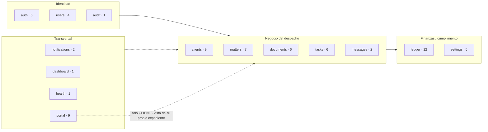

# 07 · Referencia de la API (mapa de responsabilidades)

> **Los 76 endpoints**, ninguno fuera. Prefijo global `api`. Cadena de guards global:
> `ThrottlerGuard → JwtAuthGuard (@Public exime) → RolesGuard`. El **rol efectivo** combina el
> `@Roles` de clase con el de método (el más restrictivo gana). RLS aísla por tenant aunque el rol
> pase. Derivado de `apps/api/src/**/*.controller.ts`.

## Módulo → dominio

## Tabla exhaustiva (76 / 76)

Rol = el más restrictivo aplicable. "auth" = autenticado sin `@Roles` (cualquier rol; el servicio +
RLS acotan el acceso). "público" = `@Public`.

### `auth` — `/api/auth` (5)

| Método | Ruta                        | Rol     |
| ------ | --------------------------- | ------- |
| POST   | `/api/auth/register-tenant` | público |
| POST   | `/api/auth/login`           | público |
| POST   | `/api/auth/refresh`         | público |
| POST   | `/api/auth/logout`          | público |
| GET    | `/api/auth/me`              | auth    |

### `users` — `/api/users` (4) · clase: **FIRM_ADMIN**

| Método | Ruta               | Rol        |
| ------ | ------------------ | ---------- |
| GET    | `/api/users`       | FIRM_ADMIN |
| GET    | `/api/users/seats` | FIRM_ADMIN |
| POST   | `/api/users`       | FIRM_ADMIN |
| PATCH  | `/api/users/:id`   | FIRM_ADMIN |

### `audit` — `/api/audit` (1) · clase: **FIRM_ADMIN**

| Método | Ruta         | Rol        |
| ------ | ------------ | ---------- |
| GET    | `/api/audit` | FIRM_ADMIN |

### `clients` — `/api/clients` (9) · clase: **FIRM_ADMIN, LAWYER**

| Método | Ruta                           | Rol                |
| ------ | ------------------------------ | ------------------ |
| POST   | `/api/clients`                 | FIRM_ADMIN, LAWYER |
| GET    | `/api/clients`                 | FIRM_ADMIN, LAWYER |
| GET    | `/api/clients/conflict-check`  | FIRM_ADMIN, LAWYER |
| GET    | `/api/clients/:id`             | FIRM_ADMIN, LAWYER |
| GET    | `/api/clients/:id/gdpr-export` | **FIRM_ADMIN**     |
| POST   | `/api/clients/:id/anonymize`   | **FIRM_ADMIN**     |
| PATCH  | `/api/clients/:id`             | FIRM_ADMIN, LAWYER |
| DELETE | `/api/clients/:id`             | FIRM_ADMIN, LAWYER |
| POST   | `/api/clients/:id/portal-user` | FIRM_ADMIN, LAWYER |

### `matters` — `/api/matters` (7) · clase: **FIRM_ADMIN, LAWYER**

| Método | Ruta                      | Rol                |
| ------ | ------------------------- | ------------------ |
| POST   | `/api/matters`            | FIRM_ADMIN, LAWYER |
| GET    | `/api/matters/assignees`  | **FIRM_ADMIN**     |
| GET    | `/api/matters`            | FIRM_ADMIN, LAWYER |
| GET    | `/api/matters/:id`        | FIRM_ADMIN, LAWYER |
| PATCH  | `/api/matters/:id`        | FIRM_ADMIN, LAWYER |
| PATCH  | `/api/matters/:id/lawyer` | **FIRM_ADMIN**     |
| PATCH  | `/api/matters/:id/status` | FIRM_ADMIN, LAWYER |

### `messages` — `/api/matters/:matterId/messages` (2)

| Método | Ruta                              | Rol                           |
| ------ | --------------------------------- | ----------------------------- |
| POST   | `/api/matters/:matterId/messages` | auth (miembro del expediente) |
| GET    | `/api/matters/:matterId/messages` | auth (miembro del expediente) |

### `documents` — `/api/documents` (6) · clase: **FIRM_ADMIN, LAWYER**

| Método | Ruta                                          | Rol                |
| ------ | --------------------------------------------- | ------------------ |
| POST   | `/api/documents`                              | FIRM_ADMIN, LAWYER |
| POST   | `/api/documents/:id/versions`                 | FIRM_ADMIN, LAWYER |
| GET    | `/api/documents/by-matter/:matterId`          | FIRM_ADMIN, LAWYER |
| GET    | `/api/documents/:id`                          | FIRM_ADMIN, LAWYER |
| GET    | `/api/documents/versions/:versionId/download` | FIRM_ADMIN, LAWYER |
| POST   | `/api/documents/versions/:versionId/review`   | FIRM_ADMIN, LAWYER |

### `tasks` — `/api/tasks` (6) · clase: **FIRM_ADMIN, LAWYER**

| Método | Ruta                       | Rol                |
| ------ | -------------------------- | ------------------ |
| POST   | `/api/tasks`               | FIRM_ADMIN, LAWYER |
| POST   | `/api/tasks/from-deadline` | FIRM_ADMIN, LAWYER |
| GET    | `/api/tasks`               | FIRM_ADMIN, LAWYER |
| GET    | `/api/tasks/:id`           | FIRM_ADMIN, LAWYER |
| PATCH  | `/api/tasks/:id`           | FIRM_ADMIN, LAWYER |
| DELETE | `/api/tasks/:id`           | FIRM_ADMIN, LAWYER |

### `ledger` — `/api/ledger` (12) · clase: **FIRM_ADMIN, LAWYER**

| Método | Ruta                                | Rol                |
| ------ | ----------------------------------- | ------------------ |
| POST   | `/api/ledger/costs/propose`         | FIRM_ADMIN, LAWYER |
| GET    | `/api/ledger/approvals`             | **FIRM_ADMIN**     |
| POST   | `/api/ledger/approvals/:id/approve` | **FIRM_ADMIN**     |
| POST   | `/api/ledger/approvals/:id/reject`  | **FIRM_ADMIN**     |
| POST   | `/api/ledger/entries`               | FIRM_ADMIN, LAWYER |
| POST   | `/api/ledger/time`                  | FIRM_ADMIN, LAWYER |
| GET    | `/api/ledger/matter/:matterId`      | FIRM_ADMIN, LAWYER |
| POST   | `/api/ledger/invoices/preview`      | FIRM_ADMIN, LAWYER |
| POST   | `/api/ledger/invoices`              | FIRM_ADMIN, LAWYER |
| GET    | `/api/ledger/invoices/:id`          | FIRM_ADMIN, LAWYER |
| GET    | `/api/ledger/invoices/:id/pdf`      | FIRM_ADMIN, LAWYER |
| POST   | `/api/ledger/invoices/:id/pay`      | FIRM_ADMIN, LAWYER |

### `dunning` — `/api/dunning` (2) · clase: **FIRM_ADMIN, LAWYER**

Recordatorios de cobro de facturas vencidas. Todo acotado al tenant (RLS + `user.tenantId`). El cron
diario automático llega en PR-D3 reutilizando el mismo `DunningService`.

| Método | Ruta                     | Rol                | Nota                                                    |
| ------ | ------------------------ | ------------------ | ------------------------------------------------------- |
| POST   | `/api/dunning/run`       | FIRM_ADMIN, LAWYER | "Recordar ahora": evalúa vencidas y dispara las etapas  |
| GET    | `/api/dunning/reminders` | FIRM_ADMIN, LAWYER | Recordatorios generados (línea de tiempo); `?invoiceId` |

### `retainer` — `/api/retainer` (7) · clase: **FIRM_ADMIN, LAWYER**

Provisión de fondos por expediente (saldo + movimientos). Todo acotado al tenant (RLS). PR-R2: cobro
manual de tipos no fiscales + lecturas; ANTICIPO emite factura (R2b); la factura final deduce el
anticipo (R3b); el refund de un anticipo emite rectificativa (R3c).

| Método | Ruta                          | Rol                | Nota                                                                                           |
| ------ | ----------------------------- | ------------------ | ---------------------------------------------------------------------------------------------- |
| POST   | `/api/retainer/deposit`       | FIRM_ADMIN, LAWYER | Cobro de provisión NO fiscal (SUPLIDO/GENERICO; ANTICIPO → 400)                                |
| POST   | `/api/retainer/anticipo`      | FIRM_ADMIN, LAWYER | Cobro ANTICIPO: emite factura de anticipo (Verifactu/e-CF) + acredita saldo (atómico)          |
| POST   | `/api/retainer/apply`         | FIRM_ADMIN, LAWYER | Aplica saldo (SUPLIDO/GENERICO) al cobro de una factura; ANTICIPO se realiza vía final-invoice |
| POST   | `/api/retainer/final-invoice` | FIRM_ADMIN, LAWYER | Factura final de cierre con **deducción del anticipo** (sin doble IVA), encadenada (atómico)   |
| POST   | `/api/retainer/refund`        | FIRM_ADMIN, LAWYER | Devolución de un anticipo facturado = **factura rectificativa** por sustitución (atómico)      |
| GET    | `/api/retainer/matter/:id`    | FIRM_ADMIN, LAWYER | Saldo + movimientos del expediente                                                             |
| GET    | `/api/retainer/client/:id`    | FIRM_ADMIN, LAWYER | Saldo agregado del cliente (Σ de sus expedientes)                                              |

### `billing` — `/api/billing` (4) · clase: **FIRM_ADMIN, LAWYER**

Facturación programada (recurrente / planes de pago, D-028). Crear/leer planes + generar el cuadro de
cuotas (RP2); **emisión recurrente** (RP3: 1 factura/periodo vía el núcleo fiscal). Todo acotado al tenant
(RLS). La emisión de planes de pago (INSTALLMENTS) y el cron de barrido llegan en RP4/RP5.

| Método | Ruta                             | Rol                | Nota                                                               |
| ------ | -------------------------------- | ------------------ | ------------------------------------------------------------------ |
| POST   | `/api/billing/schedules`         | FIRM_ADMIN, LAWYER | Crea un plan (RECURRING/INSTALLMENTS) + genera su cuadro de cuotas |
| GET    | `/api/billing/schedules`         | FIRM_ADMIN, LAWYER | Planes de un expediente (`?matterId=`)                             |
| GET    | `/api/billing/schedules/:id`     | FIRM_ADMIN, LAWYER | Un plan con su cuadro de cuotas                                    |
| POST   | `/api/billing/schedules/:id/run` | FIRM_ADMIN, LAWYER | Emite las facturas de los periodos vencidos (RECURRING; 1/periodo) |

### `settings` — `/api/settings` (5) · clase: **FIRM_ADMIN**

| Método | Ruta                           | Rol        |
| ------ | ------------------------------ | ---------- |
| GET    | `/api/settings`                | FIRM_ADMIN |
| PATCH  | `/api/settings`                | FIRM_ADMIN |
| POST   | `/api/settings/holidays`       | FIRM_ADMIN |
| DELETE | `/api/settings/holidays/:date` | FIRM_ADMIN |
| POST   | `/api/settings/certificate`    | FIRM_ADMIN |

### `dashboard` — `/api/dashboard` (1) · clase: **FIRM_ADMIN, LAWYER**

| Método | Ruta                     | Rol                |
| ------ | ------------------------ | ------------------ |
| GET    | `/api/dashboard/summary` | FIRM_ADMIN, LAWYER |

### `notifications` — `/api/notifications` (2)

| Método | Ruta                          | Rol                 |
| ------ | ----------------------------- | ------------------- |
| GET    | `/api/notifications`          | auth (destinatario) |
| PATCH  | `/api/notifications/:id/read` | auth (destinatario) |

### `portal` — `/api/portal` (9) · clase: **CLIENT**

| Método | Ruta                                | Rol    |
| ------ | ----------------------------------- | ------ |
| GET    | `/api/portal/me`                    | CLIENT |
| GET    | `/api/portal/matters`               | CLIENT |
| GET    | `/api/portal/matters/:id`           | CLIENT |
| GET    | `/api/portal/matters/:id/documents` | CLIENT |
| GET    | `/api/portal/matters/:id/ledger`    | CLIENT |
| GET    | `/api/portal/matters/:id/tasks`     | CLIENT |
| GET    | `/api/portal/matters/:id/retainer`  | CLIENT |
| GET    | `/api/portal/invoices`              | CLIENT |
| GET    | `/api/portal/invoices/:id/pdf`      | CLIENT |

### `health` — `/api/health` (1)

| Método | Ruta          | Rol     |
| ------ | ------------- | ------- |
| GET    | `/api/health` | público |

**Recuento:** 5+4+1+9+7+2+6+6+12+5+1+2+8+1 = **69**. ✅

## Discrepancias detectadas (docs previos vs código)

Cruzando con `HANDOFF.md`, `PLAN.md`, `DECISIONS.md` y `RUNBOOK.md`:

1. **CI = 9 jobs, no 8.** El prompt de QA hablaba de "8 jobs"; el workflow real tiene **9**: `setup`,
   `lint-typecheck`, `unit`, `api-integration`, `web-e2e`, `security`, `migration-check`, `build`,
   `ci-ok` (gate agregador). Ver [09](09-infrastructure-cicd.md).
2. **RLS sobre 16 tablas, no 14.** El bucle `enable_rls` activa 14; `rls_fail_closed` añade `Tenant` e
   `InvoiceLine` → **16**. Documentado en [03](03-multitenancy-and-rls.md).
3. **`messages` y `notifications` sin `@Roles` de clase.** No son "solo firma": cualquier usuario
   autenticado pasa el guard de rol; el control real es del servicio (membresía del expediente /
   propiedad de la notificación) + RLS. Anotado arriba como "auth".
4. **ADRs D-000..D-023 (24), no D-001..D-023.** Existe también `D-000`. Sin impacto funcional.
5. **`HANDOFF.md` desactualizado en el fallback de `SYSTEM_DATABASE_URL`.** HANDOFF afirma "si falta
   `SYSTEM_DATABASE_URL`, cae a `DIRECT_DATABASE_URL`". El código (`prisma.service.ts`) es más estricto:
   en **producción `throw`** (sin fallback); el fallback a `DIRECT_DATABASE_URL` (con aviso) **solo
   aplica fuera de producción**. La doc nueva ([03](03-multitenancy-and-rls.md),
   [04](04-encryption-and-secrets.md)) refleja el comportamiento real.
6. **`HANDOFF.md` dice "Next.js 14"; el código usa Next 15.5** (`apps/web/package.json`). Doc
   [10](10-tech-stack.md) refleja la versión real.

Salvo lo anterior (precisiones de recuento y dos puntos **stale** en HANDOFF, anotados aquí), no se
detectaron discrepancias **funcionales** entre lo que los docs afirman y lo que el código hace.
