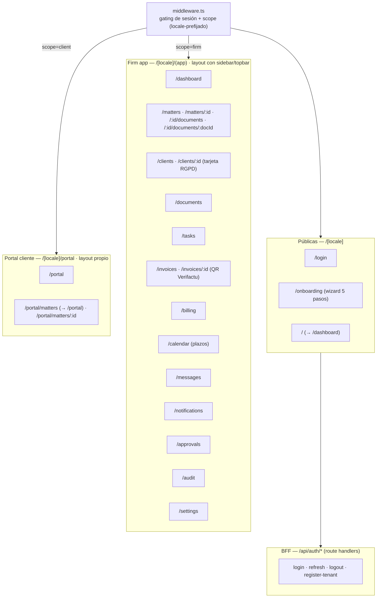
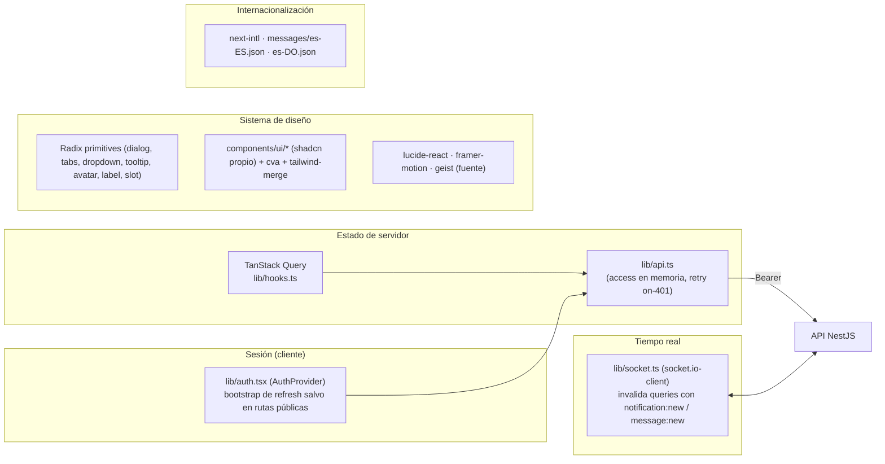

# 08 · Arquitectura del frontend (`apps/web`)

> Next.js 15 (App Router) · React 18 (fijado) · estado de servidor con TanStack Query · realtime con
> Socket.IO · i18n con next-intl (`es-ES`/`es-DO`) · sistema de diseño propio estilo shadcn sobre
> Radix. **24 páginas · 4 rutas BFF · 3 layouts · 1 middleware.**

## Mapa de rutas

- **18** páginas en el grupo `(app)` (firm), **3** en `portal`, **3** públicas (`login`, `onboarding`,
  raíz que redirige a `dashboard`). El `middleware.ts` decide a qué shell entra cada quien según la
  cookie de scope; ver [02-auth-and-sessions.md](02-auth-and-sessions.md).
- `/portal/matters` (índice) **redirige** a `/portal` (no es un 404): las tarjetas enlazan directo a
  `/portal/matters/:id`.

## Capas y responsabilidades

- **Estado de servidor:** TanStack Query (hooks en `lib/hooks.ts`). El cliente HTTP (`lib/api.ts`,
  CODEOWNERS) guarda el access en memoria y reintenta una vez ante 401 pidiendo refresh al BFF.
- **Realtime:** `lib/socket.ts` se une a las salas del usuario/tenant/expediente e invalida las queries
  pertinentes al recibir `notification:new` / `message:new`.
- **Sesión cliente:** `lib/auth.tsx` (`AuthProvider`) mintea un access desde la cookie de refresh al
  montar **salvo en rutas públicas** (login/onboarding) para no generar 401 de refresh.
- **Diseño:** componentes propios estilo shadcn (`components/ui/*`) sobre primitivas Radix, con
  `class-variance-authority` + `tailwind-merge`, iconos `lucide-react`, animación `framer-motion`,
  fuente `geist`. El QR Verifactu del portal/detalle usa `qrcode.react`.
- **i18n:** `next-intl` con catálogos `es-ES` y `es-DO` (ambos español; el segundo ajusta jurisdicción
  RD). Rutas prefijadas por locale.

## Rutas BFF (4)

`apps/web/src/app/api/auth/` — los **únicos** route handlers del web; gestionan la cookie de sesión:

| Ruta BFF                         | Hace                                                                      |
| -------------------------------- | ------------------------------------------------------------------------- |
| `POST /api/auth/login`           | proxya a Nest, fija `lf_session` (httpOnly) + `lf_scope`, devuelve access |
| `POST /api/auth/refresh`         | rota el refresh (cookie) y devuelve nuevo access                          |
| `POST /api/auth/logout`          | revoca el refresh y borra cookies                                         |
| `POST /api/auth/register-tenant` | alta de despacho (onboarding) + sesión inicial                            |

> CODEOWNERS protege `middleware.ts`, `lib/api.ts`, `lib/scope.ts` y `app/api/auth/` por ser lógica de
> sesión/seguridad. Ver [09-infrastructure-cicd.md](09-infrastructure-cicd.md).
