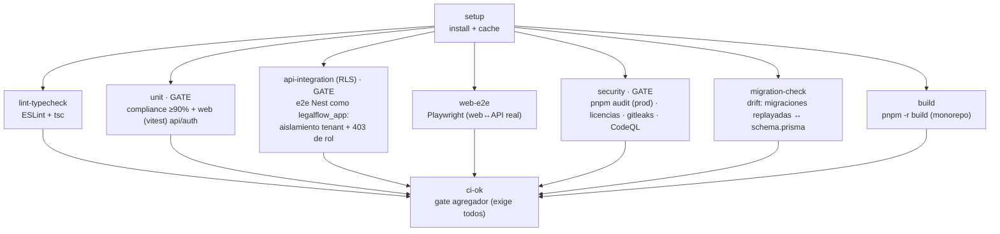
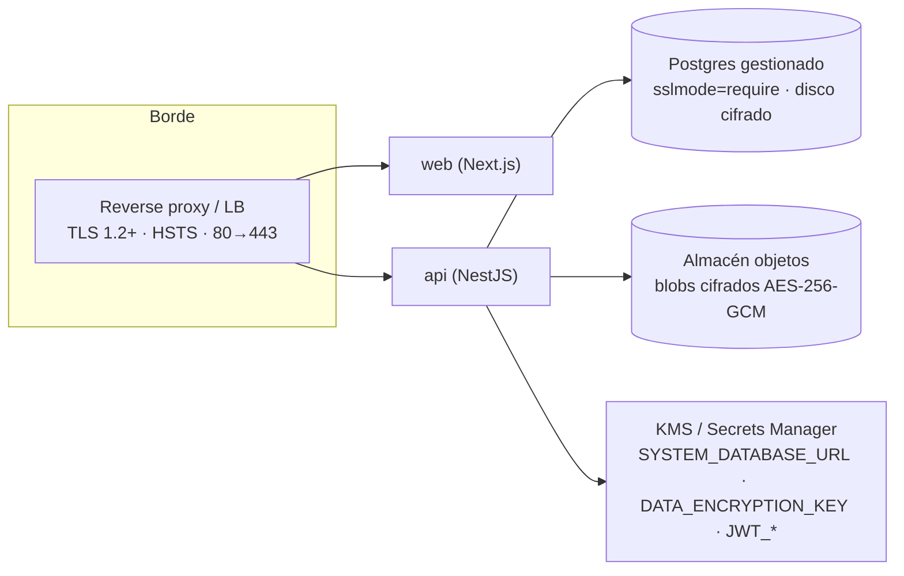

# 09 · Infraestructura y CI/CD

> Pipeline de integración continua con **gates** que codifican las invariantes del sistema (aislamiento
> RLS, cobertura fiscal, gating de rol, seguridad). La **entrega continua (CD)** está **cableada pero
> desconectada** hasta elegir hosting (D-018). Derivado de `.github/workflows/ci.yml`, `CODEOWNERS`,
> `RUNBOOK.md`.

## Infraestructura local (docker-compose)

| Servicio             | Imagen             | Rol                                         |
| -------------------- | ------------------ | ------------------------------------------- |
| `legalflow-postgres` | postgres:16-alpine | BD con RLS fail-closed                      |
| `legalflow-minio`    | minio/minio        | Almacén de objetos S3 (documentos cifrados) |
| `legalflow-redis`    | redis              | Backing del `ThrottlerGuard` / futuro       |

> `api` y `web` se ejecutan con `pnpm` en local; sus Dockerfiles existen para despliegue. MinIO crea el
> bucket por defecto al arrancar (`minio-init`).

## Pipeline de CI (9 jobs)



| Job                       | Qué verifica                                                                                                                                                                              | ¿Gate?                    |
| ------------------------- | ----------------------------------------------------------------------------------------------------------------------------------------------------------------------------------------- | ------------------------- |
| `setup`                   | Instalación y caché de dependencias                                                                                                                                                       | —                         |
| `lint-typecheck`          | ESLint + `tsc --noEmit` en todo el monorepo                                                                                                                                               | sí                        |
| `unit` (Unit + Coverage)  | **Compliance ≥90%** (Jest) + web (Vitest: cliente API + auth)                                                                                                                             | **sí (fiscal/cobertura)** |
| `api-integration` (RLS)   | Aplica migraciones (crea `legalflow_app` + `legalflow_system` + RLS), corre e2e Nest **como rol app** → **aislamiento de tenant** y **403 de rol** (un superusuario los pasaría en falso) | **sí (RLS/rol)**          |
| `web-e2e` (Playwright)    | Build API+Web y flujos reales web↔API                                                                                                                                                     | sí                        |
| `security`                | `pnpm audit --prod` (alta/crítica), **gate de licencias** (`scripts/check-licenses.mjs`), **Gitleaks**, **CodeQL**                                                                        | **sí (seguridad)**        |
| `migration-check` (Drift) | Shadow DB: las migraciones replayadas deben cuadrar con `schema.prisma`                                                                                                                   | sí                        |
| `build`                   | `pnpm -r build` del monorepo                                                                                                                                                              | sí                        |
| `ci-ok`                   | Agregador: exige que los 7 jobs anteriores pasen                                                                                                                                          | **sí (gate final)**       |

> **Nota de recuento:** son **9** jobs. `CodeQL` aparece como _check_ separado en GitHub porque es un
> paso (Initialize + Analysis) dentro del job `security` que publica su propio resultado.
> El gate `api-integration` es deliberadamente exigente: ejecuta como `legalflow_app` (NOBYPASSRLS)
> porque un rol privilegiado **saltaría RLS y los tests pasarían en falso**.

## Branch protection + CODEOWNERS

`main` está protegida; las rutas sensibles requieren revisión del owner. **9 rutas** en
`.github/CODEOWNERS`:

```
/apps/api/prisma/            /apps/api/src/auth/          /apps/api/src/prisma/
/packages/compliance/        /apps/web/src/middleware.ts  /apps/web/src/lib/api.ts
/apps/web/src/lib/scope.ts   /apps/web/src/app/api/auth/  /.github/
```

Son exactamente las piezas de **auth, RLS, compliance y sesión** — cambiarlas exige aprobación. (Por
eso el fix del bootstrap de refresh se sacó a PR aparte aunque `auth.tsx` no esté literalmente listado:
es lógica de sesión.)

## Entrega continua (CD) y topología objetivo



- **CD: cableado pero desconectado** (D-018) hasta elegir hosting. El `RUNBOOK.md` recoge la
  configuración de seguridad de despliegue (TLS, roles de BD provisionados fuera de banda, secretos en
  KMS, cifrado de disco y backups) pero **no activa nada por sí solo**.
- Checklist previo a producción en [RUNBOOK §4](../../RUNBOOK.md): roles de BD con contraseñas fuertes,
  secretos en gestor, TLS+HSTS, `sslmode=require`, cifrado de disco y backups, migraciones con rol
  propietario, smoke (login→dashboard, round-trip de documento cifrado, aislamiento de tenant).
