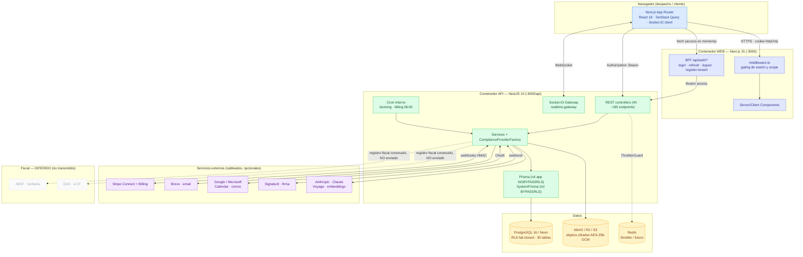

# Arquitectura de Lexora — documentación técnica

> Documentación **derivada del código real** (no de la intención ni de la memoria). Cada recuento al
> final es verificable enumerando el repositorio. Lo **diferido / no cableado** se marca como tal.
> Versión: `main`. Diagramas en Mermaid (renderizan en GitHub).
>
> 🆕 **[diagramas/](diagramas/README.md)** — set visual completo y actualizado (2026-06-29): contexto,
> topología, mapa de 60 módulos, ERD de 82 modelos, flujos de negocio/fiscales, IA agéntica, CI/CD y
> catálogo de funcionalidades (29 diagramas Mermaid).

Lexora (nombre interno **LegalFlow**) es una plataforma **multi-tenant** de gestión de despachos de
abogados para **España (ES)** y **República Dominicana (RD)**, con facturación electrónica conforme
(**Verifactu/AEAT** y **e-CF/DGII**), gestión de expedientes, documentos cifrados, plazos procesales,
portal del cliente y cumplimiento RGPD/Ley 172-13.

## Índice

| Doc                                                          | Contenido                                                                                   |
| ------------------------------------------------------------ | ------------------------------------------------------------------------------------------- |
| [00-mapa-completo.md](00-mapa-completo.md)                   | **Mapa visual de extremo a extremo**: dominios, navegación, despliegue y todos los flujos   |
| [01-data-flow.md](01-data-flow.md)                           | Ciclo de vida de una petición de extremo a extremo; subida/descarga de documentos; realtime |
| [02-auth-and-sessions.md](02-auth-and-sessions.md)           | Patrón BFF, access en memoria + refresh httpOnly, rotación y reuso, scope, gating de rol    |
| [03-multitenancy-and-rls.md](03-multitenancy-and-rls.md)     | Aislamiento por tenant con RLS fail-closed; 3 roles de BD; propagación de `app.tenant_id`   |
| [04-encryption-and-secrets.md](04-encryption-and-secrets.md) | Cifrado en tránsito y en reposo; joyas de la corona y su custodia                           |
| [05-compliance-providers.md](05-compliance-providers.md)     | Núcleo agnóstico + adaptadores Verifactu/e-CF; selección por jurisdicción                   |
| [06-data-model.md](06-data-model.md)                         | ERD completo desde `schema.prisma`; estado RLS por tabla                                    |
| [07-api-reference.md](07-api-reference.md)                   | Mapa de responsabilidades + tabla exhaustiva de los ~185 endpoints con roles                |
| [08-frontend-architecture.md](08-frontend-architecture.md)   | Rutas, BFF, TanStack Query, realtime, i18n, sistema de diseño                               |
| [09-infrastructure-cicd.md](09-infrastructure-cicd.md)       | Pipeline CI (9 jobs), CD desconectado, branch protection, CODEOWNERS                        |
| [10-tech-stack.md](10-tech-stack.md)                         | Inventario de tecnología y versiones fijadas notables                                       |

## Diagrama de contexto / contenedores

**Qué habla con qué (resumen):**

- El **navegador** carga páginas del **web** (Next.js) y llama tanto al **BFF** (`/api/auth/*`, mismo
  origen, gestiona la cookie de sesión) como directamente a la **API** (con `Authorization: Bearer`).
- El **middleware** del web hace el gating de sesión/scope en el servidor antes de renderizar.
- La **API** sirve REST + un **gateway Socket.IO** para tiempo real, habla con **Postgres** vía Prisma
  (fijando `app.tenant_id` para que RLS aísle por tenant) y con **almacenamiento de objetos** para
  documentos (cifrados a nivel de app).
- **AEAT/DGII**: el registro fiscal (Verifactu/e-CF) se **construye** pero su **envío real está
  diferido** — ver [05](05-compliance-providers.md).

---

## Completitud (verificable contra el código)

> Recuentos obtenidos enumerando el repositorio en `main`. Reproducibles con los comandos indicados.

### Endpoints

- **~185 endpoints** en **40 controladores**.
- Verificación: `grep -rhE "@(Get|Post|Put|Patch|Delete)\(" apps/api/src --include=*.controller.ts | wc -l`.
- Mapa por dominio en [00-mapa-completo.md](00-mapa-completo.md); tabla exhaustiva en [07-api-reference.md](07-api-reference.md).

### Modelos de datos

- **35 modelos** + **21 enums**.
- **Con RLS (política `tenant_isolation`): 30** — todas las tablas tenant-scoped. Incluye `Tenant` (por
  su `id`) e `InvoiceLine` (anclada al `tenantId` de su factura por subconsulta).
- **Sin RLS: 5** — Permission, RolePermission, UserRole (catálogo RBAC global / joins), RefreshToken y
  PasswordReset (acceso solo por el rol de sistema BYPASSRLS).
- Detalle por tabla en [06-data-model.md](06-data-model.md) y [03](03-multitenancy-and-rls.md).

### Variables de entorno

- **Documentadas: 21 / 21**.
- 19 declaradas en `.env.example` + 2 referenciadas en código (`API_URL`, `CORS_ORIGINS`).
- **Joyas de la corona (4):** `SYSTEM_DATABASE_URL`, `DATA_ENCRYPTION_KEY`, `JWT_ACCESS_SECRET`,
  `JWT_REFRESH_SECRET`. Detalle y custodia en [04-encryption-and-secrets.md](04-encryption-and-secrets.md).

### Dependencias

- **Inventariadas: 96** paquetes únicos (deps + devDeps) en 6 `package.json`.
- api 47 · web 44 · compliance 7 · config 5 · domain 3 · raíz 7. Detalle en [10-tech-stack.md](10-tech-stack.md).

### Módulos y providers

- **34** módulos NestJS · **2** ComplianceProvider (Spain, Dominican) · **3** StorageProvider
  (Encrypted ⊃ Local/S3) · **1** Socket.IO Gateway · **2** guards globales de auth + ThrottlerGuard ·
  **1** AiAssistantProvider (Anthropic) + **1** EmbeddingsProvider (Voyage), ambos gateados por API key.

### Frontend

- **40** páginas (`page.tsx`) · **7** rutas BFF (`/api/auth/*`) · 3 layouts · 1 middleware.

### Elementos DIFERIDOS / no cableados (marcados como tales en cada doc)

| Elemento                                                         | Estado                                                                               | ADR         |
| ---------------------------------------------------------------- | ------------------------------------------------------------------------------------ | ----------- |
| IA (asistente, RAG, resúmenes, correos)                          | **Cableada** (Anthropic + Voyage); inactiva sin `ANTHROPIC_API_KEY`/`VOYAGE_API_KEY` | D-011       |
| Envío real a AEAT (Verifactu)                                    | Registro **construido**, **no transmitido**                                          | D-016/D-022 |
| Envío real a DGII (e-CF)                                         | Registro **construido**, **no transmitido**                                          | D-016/D-022 |
| Pasarela de pago en RD                                           | **Stub** (Stripe no opera en RD); ES usa Stripe Connect real                         | D-024       |
| Canales EMAIL/SMS de dunning                                     | **Diferidos** (fase 2); hoy solo `IN_APP` (se marcan `SKIPPED`)                      | —           |
| Entrega continua (CD)                                            | **Activa en Fly.io** (api/web, región fra); deploy de web manual                     | D-018       |
| Cifrado de **columna** de PII                                    | **Diferido**; cubierto por cifrado de disco/volumen                                  | D-021       |
| Rotación de `DATA_ENCRYPTION_KEY`                                | **Gap conocido**: una sola clave, sin re-cifrado                                     | D-021       |
| `getCourtIntegration` / `getFiscalReports` (interfaz compliance) | Contrato presente, integración externa **diferida**                                  | D-016       |

### Discrepancias detectadas (docs previos vs código)

Ver la sección homónima al final de [07-api-reference.md](07-api-reference.md). Resumen: ninguna
discrepancia funcional bloqueante; los matices encontrados (p. ej. recuento de jobs de CI = **9**
incluyendo `ci-ok`, no 8; y RLS sobre **30** tablas: las 16 del `rls_fail_closed` más 14 añadidas en
migraciones posteriores) se anotan allí.

---

Enlazado desde el [README raíz](../../README.md) y desde [HANDOFF.md](../../HANDOFF.md).
