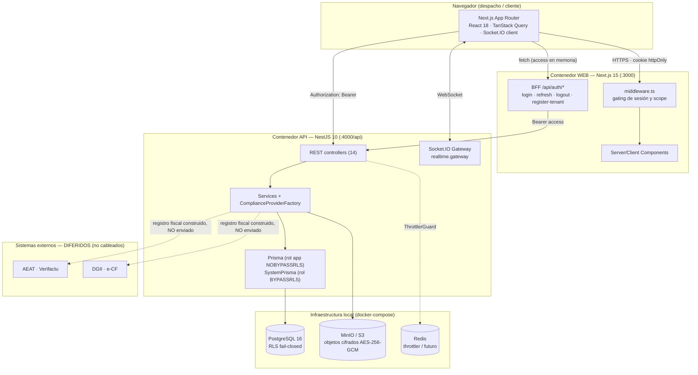

# Arquitectura de Lexora — documentación técnica

> Documentación **derivada del código real** (no de la intención ni de la memoria). Cada recuento al
> final es verificable enumerando el repositorio. Lo **diferido / no cableado** se marca como tal.
> Versión: `main`. Diagramas en Mermaid (renderizan en GitHub).

Lexora (nombre interno **LegalFlow**) es una plataforma **multi-tenant** de gestión de despachos de
abogados para **España (ES)** y **República Dominicana (RD)**, con facturación electrónica conforme
(**Verifactu/AEAT** y **e-CF/DGII**), gestión de expedientes, documentos cifrados, plazos procesales,
portal del cliente y cumplimiento RGPD/Ley 172-13.

## Índice

| Doc                                                          | Contenido                                                                                   |
| ------------------------------------------------------------ | ------------------------------------------------------------------------------------------- |
| [01-data-flow.md](01-data-flow.md)                           | Ciclo de vida de una petición de extremo a extremo; subida/descarga de documentos; realtime |
| [02-auth-and-sessions.md](02-auth-and-sessions.md)           | Patrón BFF, access en memoria + refresh httpOnly, rotación y reuso, scope, gating de rol    |
| [03-multitenancy-and-rls.md](03-multitenancy-and-rls.md)     | Aislamiento por tenant con RLS fail-closed; 3 roles de BD; propagación de `app.tenant_id`   |
| [04-encryption-and-secrets.md](04-encryption-and-secrets.md) | Cifrado en tránsito y en reposo; joyas de la corona y su custodia                           |
| [05-compliance-providers.md](05-compliance-providers.md)     | Núcleo agnóstico + adaptadores Verifactu/e-CF; selección por jurisdicción                   |
| [06-data-model.md](06-data-model.md)                         | ERD completo desde `schema.prisma`; estado RLS por tabla                                    |
| [07-api-reference.md](07-api-reference.md)                   | Mapa de responsabilidades + tabla exhaustiva de los 69 endpoints con roles                  |
| [08-frontend-architecture.md](08-frontend-architecture.md)   | Rutas, BFF, TanStack Query, realtime, i18n, sistema de diseño                               |
| [09-infrastructure-cicd.md](09-infrastructure-cicd.md)       | Pipeline CI (9 jobs), CD desconectado, branch protection, CODEOWNERS                        |
| [10-tech-stack.md](10-tech-stack.md)                         | Inventario de tecnología y versiones fijadas notables                                       |

## Diagrama de contexto / contenedores

**Qué habla con qué (resumen):**

- El **navegador** carga páginas del **web** (Next.js) y llama tanto al **BFF** (`/api/auth/*`, mismo
  origen, gestiona la cookie de sesión) como directamente a la **API** (con `Authorization: Bearer`).
- El **middleware** del web hace el gating de sesión/scope en el servidor antes de renderizar.
- La **API** sirve REST + un **gateway Socket.IO** para tiempo real, habla con **Postgres** vía Prisma
  (fijando `app.tenant_id` para que RLS aísle por tenant) y con **almacenamiento de objetos** para
  documentos (cifrados a nivel de app).
- **AEAT/DGII**: el registro fiscal (Verifactu/e-CF) se **construye** pero su **envío real está
  diferido** — ver [05](05-compliance-providers.md).

---

## Completitud (verificable contra el código)

> Recuentos obtenidos enumerando el repositorio en `main`. Reproducibles con los comandos indicados.

### Endpoints

- **Documentados: 69 / 69** encontrados.
- 14 controladores · 33 `@Get` · 25 `@Post` · 8 `@Patch` · 3 `@Delete`.
- Verificación: `grep -rE "@(Get|Post|Put|Patch|Delete)\(" apps/api/src --include=*.controller.ts | wc -l`.
- Tabla exhaustiva en [07-api-reference.md](07-api-reference.md).

### Modelos de datos

- **Documentados: 20 / 20** modelos + **8 enums**.
- **Con RLS (política tenant): 16** — Tenant, User, Role, Client, Matter, Document, DocumentVersion,
  DocumentReview, Task, TimeEntry, LedgerEntry, Invoice, InvoiceLine, Notification, Message, AuditLog.
- **Sin RLS: 4** — Permission, RolePermission, UserRole (catálogo RBAC global / join), RefreshToken
  (almacén de tokens al que solo accede el rol de sistema BYPASSRLS).
- Detalle por tabla en [06-data-model.md](06-data-model.md) y [03](03-multitenancy-and-rls.md).

### Variables de entorno

- **Documentadas: 21 / 21**.
- 19 declaradas en `.env.example` + 2 referenciadas en código (`API_URL`, `CORS_ORIGINS`).
- **Joyas de la corona (4):** `SYSTEM_DATABASE_URL`, `DATA_ENCRYPTION_KEY`, `JWT_ACCESS_SECRET`,
  `JWT_REFRESH_SECRET`. Detalle y custodia en [04-encryption-and-secrets.md](04-encryption-and-secrets.md).

### Dependencias

- **Inventariadas: 96** paquetes únicos (deps + devDeps) en 6 `package.json`.
- api 47 · web 44 · compliance 7 · config 5 · domain 3 · raíz 7. Detalle en [10-tech-stack.md](10-tech-stack.md).

### Módulos y providers

- **18** módulos NestJS · **2** ComplianceProvider (Spain, Dominican) · **3** StorageProvider
  (Encrypted ⊃ Local/S3) · **1** Socket.IO Gateway · **2** guards globales de auth + ThrottlerGuard.

### Frontend

- **24** páginas (`page.tsx`) · **4** rutas BFF (`/api/auth/*`) · 3 layouts · 1 middleware.

### Elementos DIFERIDOS / no cableados (marcados como tales en cada doc)

| Elemento                                                         | Estado                                                                                  | ADR         |
| ---------------------------------------------------------------- | --------------------------------------------------------------------------------------- | ----------- |
| `AiAssistantProvider`                                            | **Solo contrato** (`packages/domain/src/contracts/ai-assistant.ts`), sin implementación | D-011       |
| Envío real a AEAT (Verifactu)                                    | Registro **construido**, **no transmitido**                                             | D-016/D-022 |
| Envío real a DGII (e-CF)                                         | Registro **construido**, **no transmitido**                                             | D-016/D-022 |
| Entrega continua (CD)                                            | **Cableada pero desconectada** hasta elegir hosting                                     | D-018       |
| Cifrado de **columna** de PII                                    | **Diferido**; cubierto por cifrado de disco/volumen                                     | D-021       |
| Rotación de `DATA_ENCRYPTION_KEY`                                | **Gap conocido**: una sola clave, sin re-cifrado                                        | D-021       |
| `getCourtIntegration` / `getFiscalReports` (interfaz compliance) | Contrato presente, integración externa **diferida**                                     | D-016       |

### Discrepancias detectadas (docs previos vs código)

Ver la sección homónima al final de [07-api-reference.md](07-api-reference.md). Resumen: ninguna
discrepancia funcional bloqueante; los matices encontrados (p. ej. recuento de jobs de CI = **9**
incluyendo `ci-ok`, no 8; y RLS sobre **16** tablas al incluir `Tenant` e `InvoiceLine` del
`rls_fail_closed`) se anotan allí.

---

Enlazado desde el [README raíz](../../README.md) y desde [HANDOFF.md](../../HANDOFF.md).
