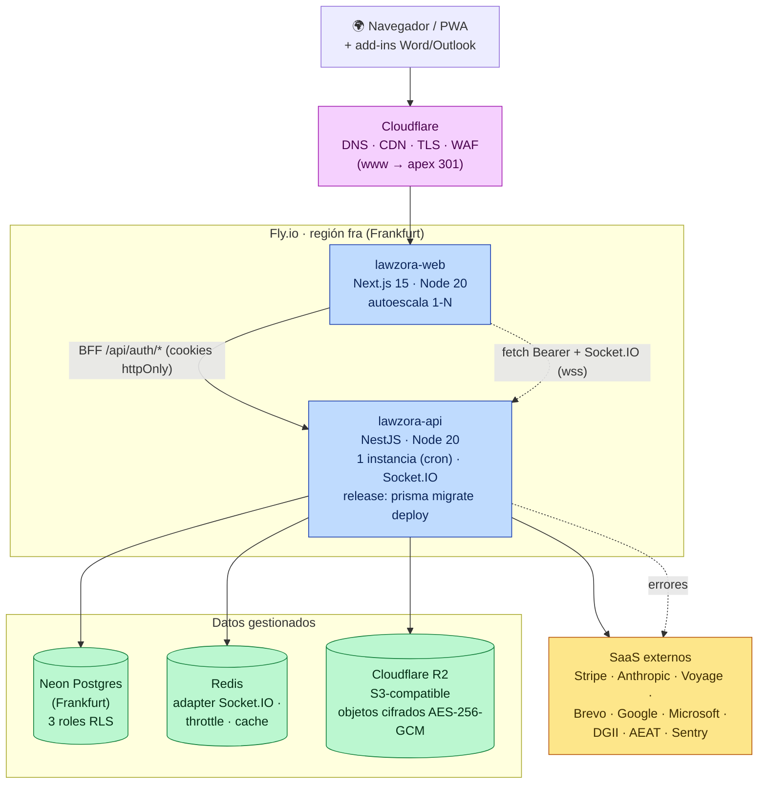

# 01 · Contexto del sistema y topología de despliegue

[⬅ Volver al índice](README.md)

---

## 1.1 Contexto del sistema (C4 nivel 1)

Quién usa Lawzora y con qué sistemas externos habla.

```mermaid
flowchart TB
  classDef ext fill:#fde68a,stroke:#b45309,color:#3f2d00;
  classDef core fill:#bfdbfe,stroke:#1e40af,color:#0b2559;
  classDef actor fill:#e9d5ff,stroke:#7e22ce,color:#3b0764;

  subgraph Actores
    staff["👩‍⚖️ Personal del despacho<br/>(FIRM_ADMIN · LAWYER)"]:::actor
    cliente["👤 Cliente final<br/>(portal, rol CLIENT)"]:::actor
    contraparte["🤝 Contraparte / asesor<br/>(data room por enlace mágico)"]:::actor
    admin["🛠️ Super-admin de plataforma"]:::actor
    lead["🌐 Lead público<br/>(formulario de captación)"]:::actor
  end

  sistema(["<b>LAWZORA</b><br/>SaaS legal multi-tenant<br/>ES + RD"]):::core

  staff --> sistema
  cliente --> sistema
  contraparte --> sistema
  admin --> sistema
  lead --> sistema

  subgraph Pagos_y_fiscal["Pagos y fiscal"]
    stripe["Stripe<br/>(suscripción + Connect)"]:::ext
    dgii["DGII (RD)<br/>recepción e-CF"]:::ext
    aeat["AEAT (ES)<br/>Verifactu"]:::ext
  end

  subgraph IA
    anthropic["Anthropic Claude<br/>(agente + redacción)"]:::ext
    voyage["Voyage AI<br/>(embeddings RAG)"]:::ext
  end

  subgraph Productividad
    google["Google<br/>(Calendar · Gmail · Drive)"]:::ext
    microsoft["Microsoft 365<br/>(Outlook · OneDrive · SharePoint)"]:::ext
    signaturit["Signaturit<br/>(firma electrónica · stub)"]:::ext
    lexnet["LexNET-lite<br/>(notificaciones judiciales)"]:::ext
  end

  subgraph Plataforma
    brevo["Brevo<br/>(email transaccional)"]:::ext
    sentry["Sentry<br/>(observabilidad)"]:::ext
    cloudflare["Cloudflare<br/>(DNS · CDN · WAF)"]:::ext
  end

  sistema --> stripe & dgii & aeat
  sistema --> anthropic & voyage
  sistema --> google & microsoft & signaturit & lexnet
  sistema --> brevo & sentry
  cloudflare --> sistema
```

> **Nota:** muchas integraciones externas son **opcionales y gated por variable de entorno** — si la clave no está, la función se desactiva limpiamente (p. ej. sin `ANTHROPIC_API_KEY` la IA se oculta; sin `STRIPE_*` el cobro online queda off; e-CF/Verifactu quedan _STUBBED_ sin certificado).

---

## 1.2 Topología de despliegue (infraestructura)

Dónde corre cada cosa en producción.

### Detalle de plataforma

| Componente       | Tecnología                     | Ubicación    | Notas                                                                                                                                                              |
| ---------------- | ------------------------------ | ------------ | ------------------------------------------------------------------------------------------------------------------------------------------------------------------ |
| Web              | Next.js 15 (App Router)        | Fly.io `fra` | Autoescala; health en `/api/health` y ruta de login. Manual deploy `flyctl deploy -c fly.web.toml --remote-only`                                                   |
| API              | NestJS / Node 20               | Fly.io `fra` | 1 instancia always-on (cron de dunning/deadlines). `release_command` ejecuta migraciones                                                                           |
| Base de datos    | Neon Postgres                  | Frankfurt    | **3 roles**: `legalflow` (migraciones), `legalflow_app` (runtime mínimo-privilegio, RLS), `legalflow_system` (BYPASSRLS, solo cross-tenant: login/registro/tokens) |
| Cache / realtime | Redis                          | gestionado   | Adapter Socket.IO multi-instancia, buckets de rate-limit, cache                                                                                                    |
| Almacenamiento   | Cloudflare R2 (S3)             | —            | Cifrado en reposo AES-256-GCM (`DATA_ENCRYPTION_KEY`, rotación con `*_RETIRED`). En dev: filesystem/MinIO                                                          |
| DNS/CDN/TLS      | Cloudflare                     | —            | apex canónico; `www → apex` 301                                                                                                                                    |
| Email            | Brevo                          | —            | Transaccional + marketing; dominio autenticado SPF/DKIM                                                                                                            |
| Observabilidad   | Sentry (API + web) + pino JSON | —            | `SENTRY_DSN`; logs redactan `Authorization`/`Cookie`                                                                                                               |

### Secretos clave (boot **falla en prod** si faltan)

`DATABASE_URL` · `SYSTEM_DATABASE_URL` · `DIRECT_DATABASE_URL` · `JWT_ACCESS_SECRET` · `JWT_REFRESH_SECRET` · `PLATFORM_JWT_SECRET` (distinto del de acceso) · `DATA_ENCRYPTION_KEY` · `CORS_ORIGINS`.

Opcionales (activan función): `ANTHROPIC_API_KEY` · `VOYAGE_API_KEY` · `STRIPE_*` · `DGII_ENV`/cert · `GOOGLE_*` · `MS_*` · `SIGNATURE_WEBHOOK_SECRET` · `REDIS_URL` · `SENTRY_DSN`.
