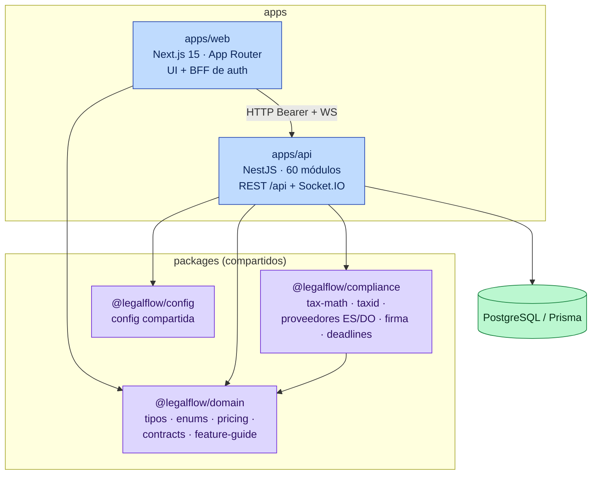
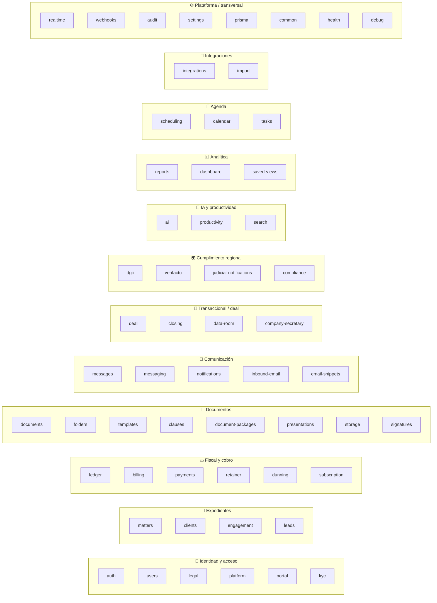
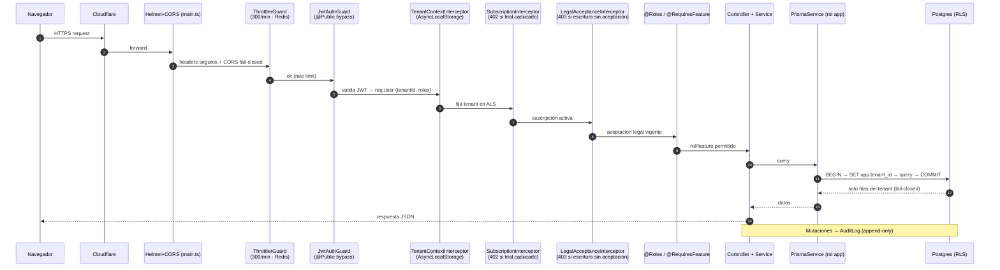
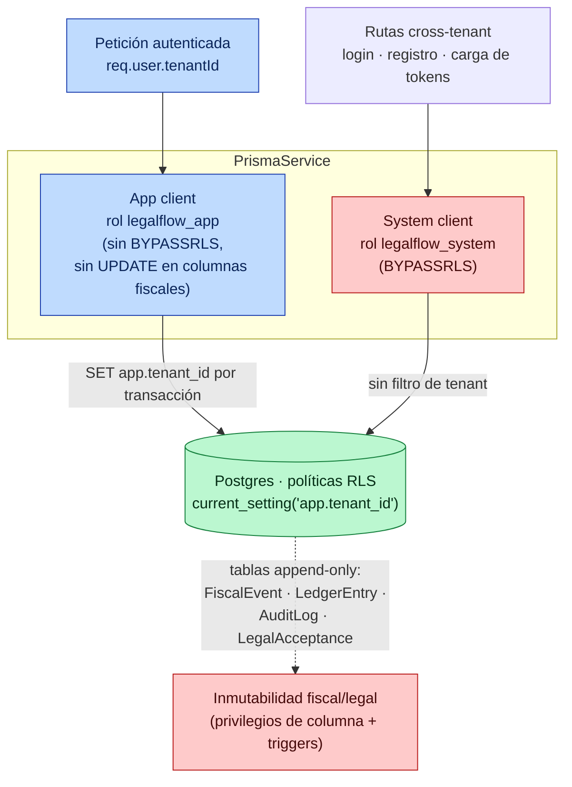

# 02 · Módulos y arquitectura interna

[⬅ Volver al índice](README.md)

---

## 2.1 Monorepo (contenedores · C4 nivel 2)

---

## 2.2 Módulos del API por dominio (C4 nivel 3)

Los **60 módulos** de `apps/api/src` agrupados en 16 dominios funcionales.

> Módulos transversales **`common` / `prisma`** proveen guards, decoradores e interceptores y el cliente Prisma tenant-aware que usan todos los demás. `data-room` y `company-secretary` agrupan varios submodelos (ver [ERD](03-modelo-datos.md)).

---

## 2.3 Ciclo de vida de una petición (guards · interceptores · RLS)

Orden real de la cadena global definida en `app.module.ts` + `main.ts`.

### Decoradores y gates

| Decorador                      | Efecto                                                                      |
| ------------------------------ | --------------------------------------------------------------------------- |
| `@Public`                      | Salta JWT (login, registro, refresh, health, webhooks firmados)             |
| `@Roles(...)`                  | Exige uno de los roles (FIRM_ADMIN / LAWYER / CLIENT)                       |
| `@RequiresFeature(x)`          | Exige que el plan incluya la feature (p. ej. `ai`, `data-room`)             |
| `@AllowExpired`                | Permite acceso aunque el trial haya caducado (auth/checkout/status)         |
| `@AllowWithoutLegalAcceptance` | Permite escritura sin aceptación legal vigente                              |
| `PlatformGuard`                | JWT separado de super-admin (`PLATFORM_JWT_SECRET`), cross-tenant, auditado |

---

## 2.4 Multitenancy y aislamiento (RLS de 3 roles)

- **Fail-closed:** sin contexto de tenant, las consultas devuelven **0 filas**.
- **Mínimo privilegio:** al arrancar se verifica que el rol de runtime no es superusuario, no tiene BYPASSRLS y no puede actualizar columnas de `Invoice` (fatal en prod si falla).
- **Tablas globales** (no tenant-scoped): `Permission`, `LegalDocument`, `ProcessedStripeEvent`.
