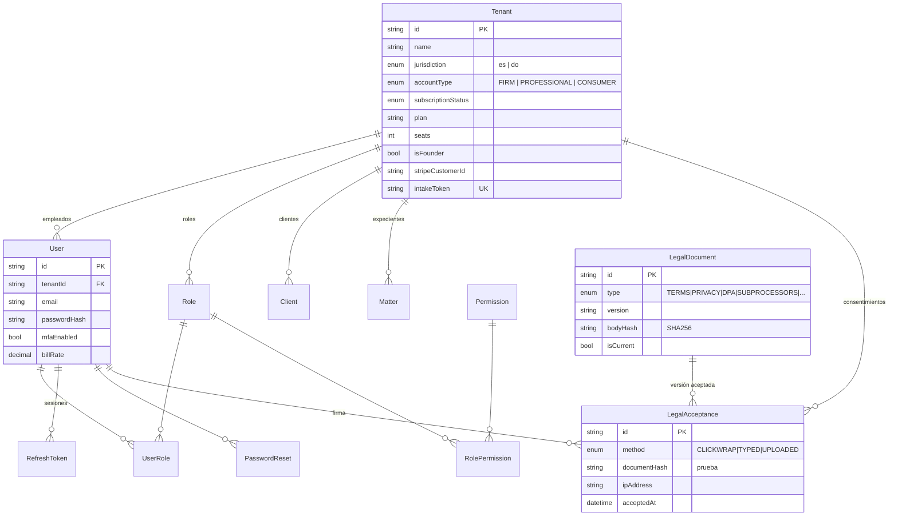
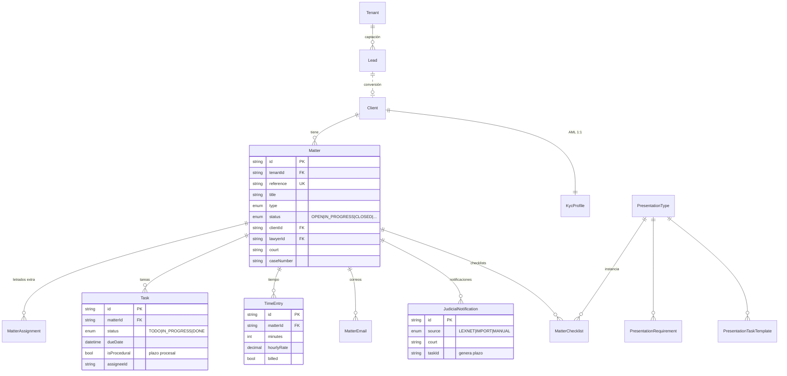
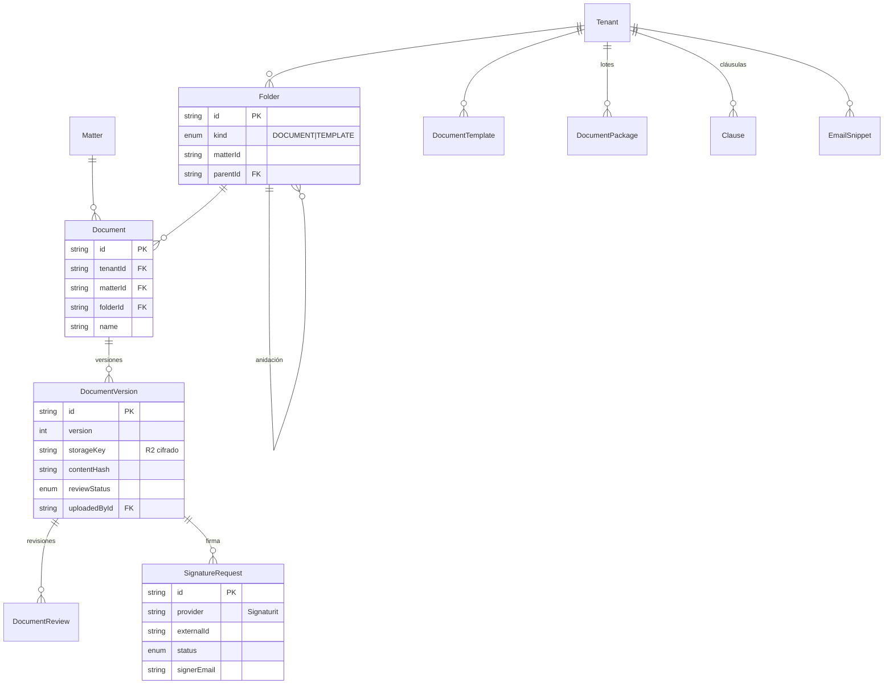
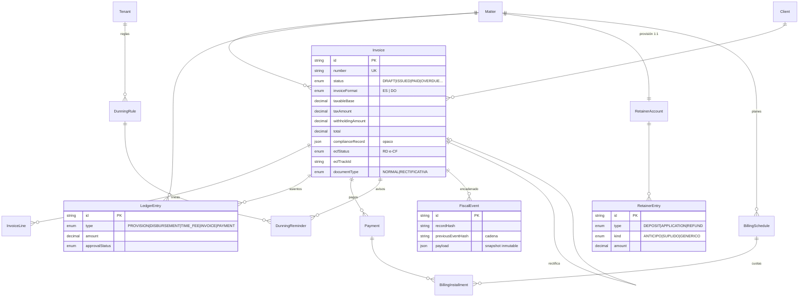
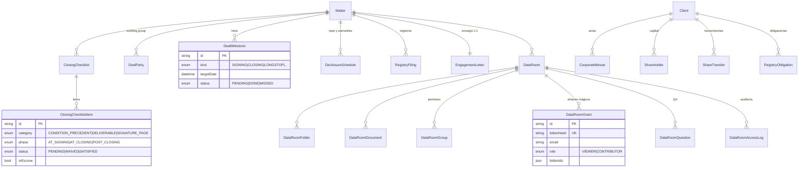
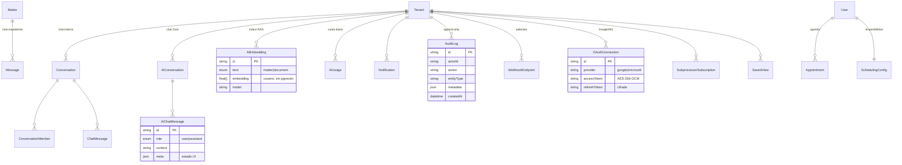

# 03 · Modelo de datos (ERD por dominios)

[⬅ Volver al índice](README.md)

Los **82 modelos** Prisma agrupados por dominio. Casi todas las tablas llevan `tenantId` (eje de multitenancy). Se muestran solo los campos y relaciones relevantes.

**Entidades-eje:** `Tenant` (raíz multitenant) · `Matter` (expediente) · `Client` · `User` · `Invoice` (núcleo fiscal).

---

## 3.1 Identidad, tenant y RBAC

> `LegalAcceptance` y `AuditLog` son **append-only**. `LegalDocument`, `Permission` y `ProcessedStripeEvent` son **globales** (no tenant-scoped).

---

## 3.2 Expedientes, clientes, tareas y tiempo

---

## 3.3 Documentos, carpetas, plantillas y firma

---

## 3.4 Fiscal, facturación, cobro y provisiones

> `FiscalEvent` y `LedgerEntry` son **append-only**; la integridad fiscal se garantiza por **encadenado de hash** (`recordHash`/`previousEventHash`) y privilegios de columna en `Invoice`. `InvoiceSequence` y `EcfSequence` gestionan numeración y rangos eNCF autorizados (RD).

---

## 3.5 Transaccional: closing, data room y secretaría corporativa

---

## 3.6 Comunicación, IA, integraciones y auditoría

---

## 3.7 Dominios → modelos (índice rápido)

| #   | Dominio                     | Modelos                                                                                                                                             |
| --- | --------------------------- | --------------------------------------------------------------------------------------------------------------------------------------------------- |
| 1   | Identidad / Tenant / RBAC   | Tenant, User, Role, Permission, UserRole, RolePermission, RefreshToken, PasswordReset                                                               |
| 2   | Clientes / Contactos        | Client, KycProfile, Lead                                                                                                                            |
| 3   | Expedientes                 | Matter, MatterAssignment, MatterReadState, MatterEmail, MatterChecklist                                                                             |
| 4   | Documentos / Almacenamiento | Document, DocumentVersion, DocumentReview, DocumentTemplate, DocumentPackage, Folder, SignatureRequest, EmailSnippet                                |
| 5   | Fiscal / Facturación        | Invoice, InvoiceLine, InvoiceSequence, LedgerEntry, FiscalEvent, EcfSequence                                                                        |
| 6   | Cobro / Suscripción         | Payment, BillingSchedule, BillingInstallment, RetainerAccount, RetainerEntry, DunningRule, DunningReminder, ProcessedStripeEvent, SavedView, Clause |
| 7   | Tareas / Tiempo             | Task, TimeEntry, JudicialNotification                                                                                                               |
| 8   | Transaccional / Deal        | ClosingChecklist, ClosingChecklistItem, DealParty, DealMilestone, DisclosureSchedule, RegistryFiling, DataRoom (+6 submodelos)                      |
| 9   | Secretaría corporativa      | EngagementLetter, CorporateMinute, Shareholder, ShareTransfer, RegistryObligation                                                                   |
| 10  | Agenda                      | SchedulingConfig, Appointment                                                                                                                       |
| 11  | Cumplimiento legal          | LegalDocument, LegalAcceptance                                                                                                                      |
| 12  | Mensajería                  | Message, Conversation, ConversationMember, ChatMessage, AiConversation, AiChatMessage                                                               |
| 13  | IA / Embeddings             | AiEmbedding, AiUsage                                                                                                                                |
| 14  | Auditoría / Plataforma      | AuditLog, Notification, WebhookEndpoint, SubprocessorSubscription                                                                                   |
| 15  | Integraciones               | OAuthConnection                                                                                                                                     |
| 16  | Checklists de presentación  | PresentationType, PresentationRequirement, PresentationTaskTemplate                                                                                 |
