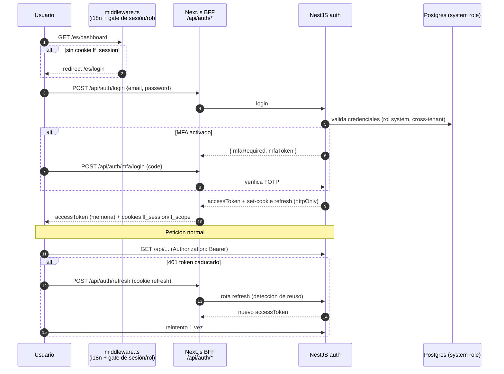
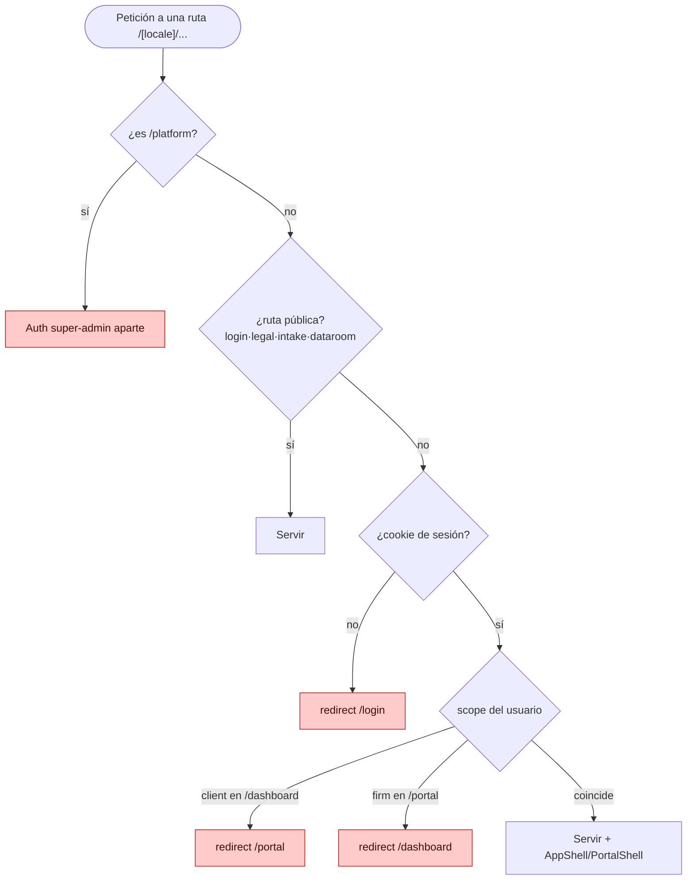
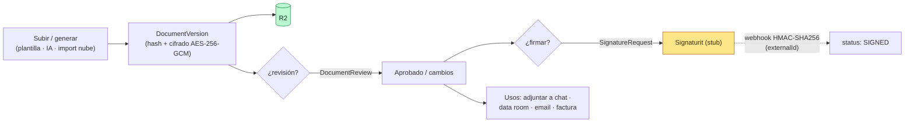
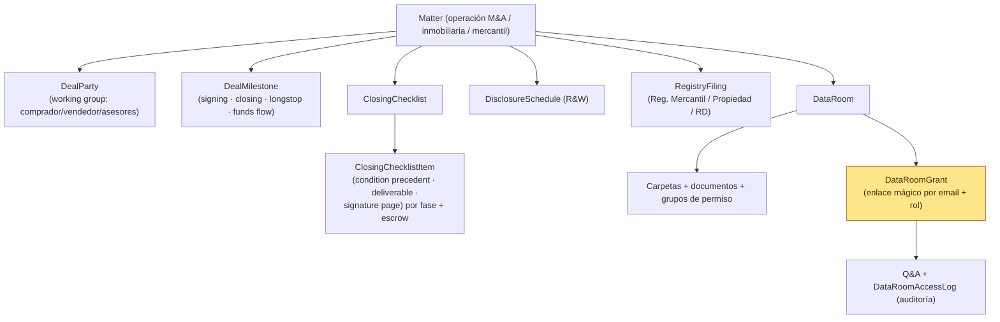
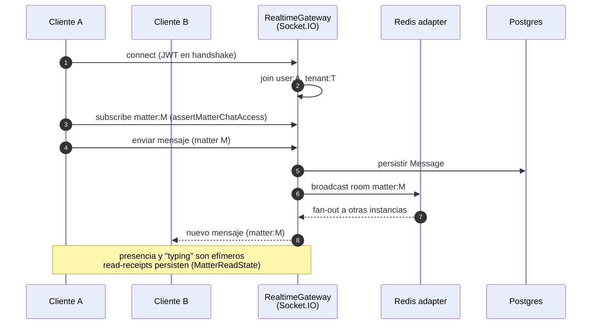

# 04 · Flujos de negocio

[⬅ Volver al índice](README.md)

---

## 4.1 Autenticación, sesión y refresco de token

Modelo BFF: token de acceso **en memoria**, refresh en **cookie httpOnly**.

- Cookies: `lf_session` (gate de middleware), `lf_scope` (`firm` | `client`) para RBAC de rutas.
- Multi-despacho: un mismo email puede pertenecer a varios tenants → selección de tenant en login.
- Social login (Google/Microsoft/OIDC) → `POST /api/auth/social/finish {ticket}`.

---

## 4.2 Gating de acceso a la app interna (RBAC en el borde)

---

## 4.3 Ciclo de vida de un documento + firma electrónica

- Generación por **lote** (`document-packages`), **plantillas** (`templates`) y **cláusulas** (`clauses`).
- Import desde nube: Google Drive (Picker + `drive.file`), OneDrive/SharePoint (server-side).
- Add-ins de **Word/Outlook** insertan cláusulas/snippets directamente desde Office (iframe + CSP `frame-ancestors`).

---

## 4.4 Transaccional: deal · closing · data room

> Distinción clave: **longstop / fechas de operación ≠ plazos procesales** (estos últimos viven en `Task.isProcedural` y `JudicialNotification`). La secretaría corporativa (actas, capital, obligaciones registrales recurrentes) cuelga del `Client`, no del `Matter`.

---

## 4.5 Mensajería en tiempo real (Socket.IO + Redis)

- **3 canales de chat**: por expediente (`messages`, staff+cliente), interno entre staff (`messaging`: DM 1:1 + canal General), y privado con la IA Zora (`AiConversation`).
- Adapter Redis activo solo si `REDIS_URL` está definido (necesario para multi-instancia en Fly); fallback en memoria.
- Notificaciones in-app y toasts viajan por los mismos sockets (`user:<id>`).
