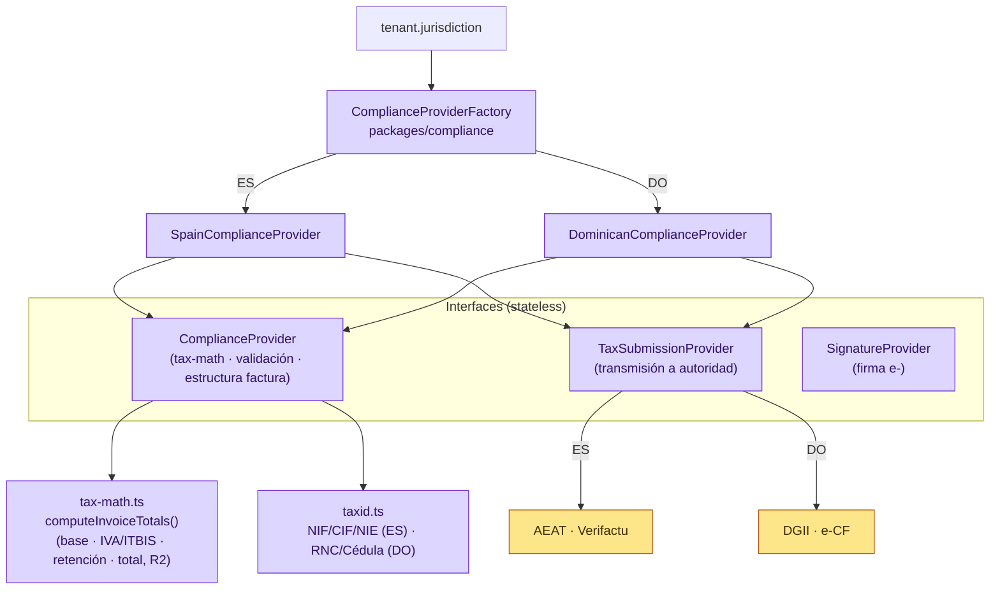
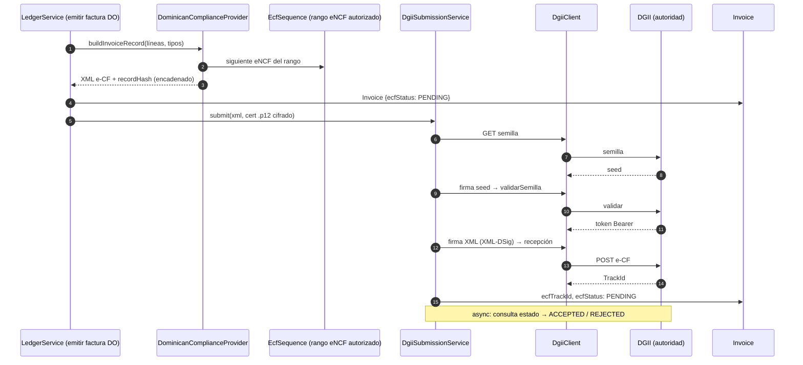
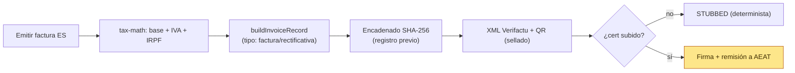
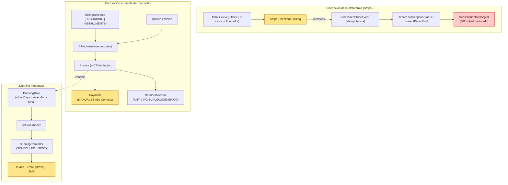

# 05 · Flujos fiscales y de cobro

[⬅ Volver al índice](README.md)

El núcleo de facturación es **agnóstico**; el comportamiento por país entra por **adaptadores** seleccionados según `tenant.jurisdiction`.

---

## 5.1 Patrón proveedor de cumplimiento (ES / DO)

- **Misma `tax-math`** en la previsualización (UI read-only) y en la emisión → fuente única de la verdad.
- Tipos: ES IVA 21/10 % + IRPF 15/7 % (retención); DO ITBIS 18 % (sin retención en el MVP).
- Transmisión a la autoridad es **stubeable**: sin certificado/`DGII_ENV`, devuelve estado `STUBBED` determinista. La integridad fiscal se mantiene siempre (encadenado de hash en `FiscalEvent`).

---

## 5.2 Emisión + transmisión e-CF a la DGII (República Dominicana)

- Custodia del certificado `.p12` **cifrado por despacho**; activación con `DGII_ENV=cert|prod`.
- Numeración por **rangos eNCF autorizados** (`EcfSequence`) — re-registrar un rango no reinicia el contador (lección de seguridad fiscal).

---

## 5.3 Verifactu (España)

- Subida de certificado autoservicio por `FIRM_ADMIN`: `GET /verifactu/status` · `POST /verifactu/certificate` (.p12 + password).
- Rectificativas referencian la factura original (`Invoice.rectifiesInvoiceId`).

---

## 5.4 Suscripción SaaS, facturación recurrente, cobro y dunning

- Cobro por jurisdicción: **Stripe Connect** en ES; en RD el cobro online queda en stub (Stripe no opera allí) — pagos manuales registrados.
- Idempotencia de webhooks Stripe vía `ProcessedStripeEvent` (tabla global).
- `RetainerEntry` distingue **anticipos** (con factura) de **suplidos/genéricos** (no fiscales).
