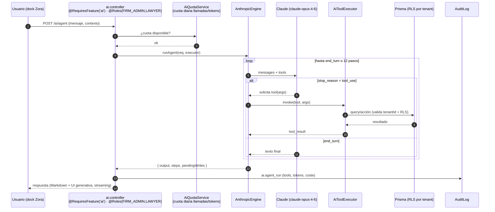
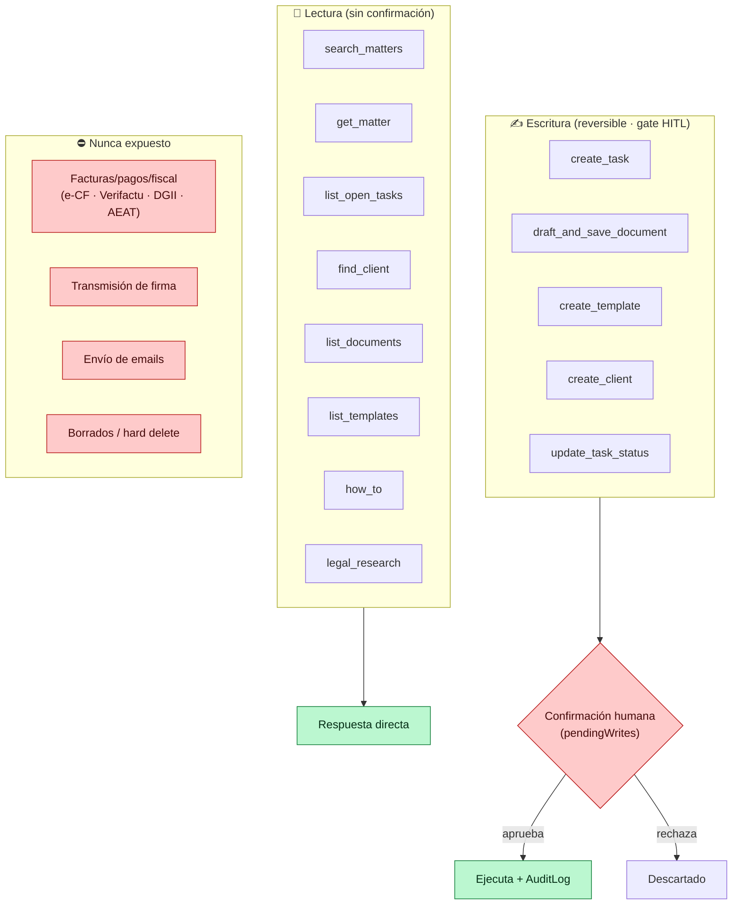
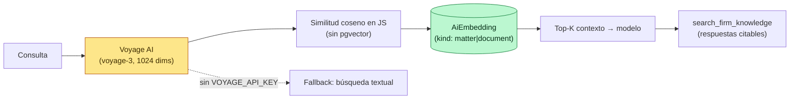

# 06 · IA agéntica (Zora)

[⬅ Volver al índice](README.md)

Asistente legal con **tool-use** (Anthropic Claude) sobre los datos del despacho, con gate humano antes de escribir y sin acciones fiscales. Ref: `docs/architecture/ADR-001-agentic-ai.md`.

---

## 6.1 Bucle del agente (tool-use loop)

- Máx. **12 iteraciones**; todos los tokens (entrada + salida de todas las vueltas) cuentan contra la cuota.
- Streaming NDJSON al dock (`api.stream`), con render Markdown + UI generativa.
- Sin `ANTHROPIC_API_KEY` → `DisabledEngine` (503) y la UI oculta la IA.

---

## 6.2 Catálogo de tools y gate HITL

> Toda escritura del agente es **reversible y no fiscal**, y los borradores de documento quedan en estado `PENDING` de revisión humana.

---

## 6.3 RAG citable (búsqueda semántica)

| Aspecto               | Valor                                                                         |
| --------------------- | ----------------------------------------------------------------------------- |
| Modelo de chat/agente | `claude-opus-4-6` (configurable `AI_MODEL`)                                   |
| Embeddings            | Voyage `voyage-3`, 1024 dims (opcional)                                       |
| Cuotas por tenant/día | llamadas + tokens (`AI_DAILY_*_LIMIT`)                                        |
| Rate limit IA         | ~20 req/min (sobre el global de 300/min)                                      |
| Auditoría             | evento `ai.agent_run` con tools, tokens y coste                               |
| `legal_research`      | apunta a fuentes primarias (CENDOJ/BOE, Poder Judicial/DGII) — **no ingesta** |
