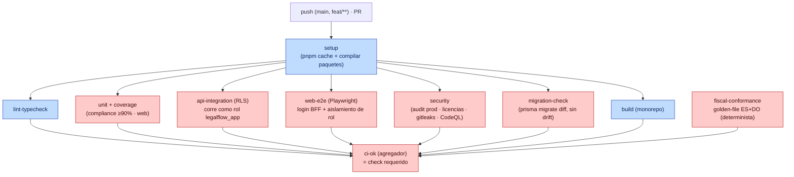
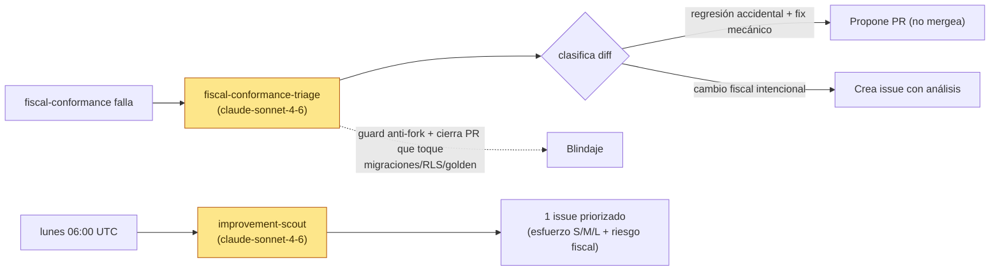
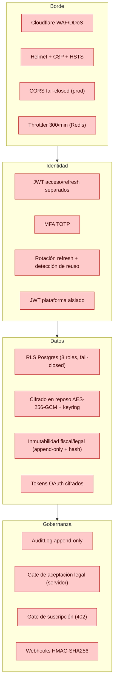

# 07 · CI/CD y seguridad

[⬅ Volver al índice](README.md)

---

## 7.1 Pipeline de integración continua (GitHub Actions)

### Gates obligatorios (branch protection)

| Check                | Qué garantiza                                                                                                                     |
| -------------------- | --------------------------------------------------------------------------------------------------------------------------------- |
| `ci-ok`              | Agrega lint/type, unit+coverage, RLS, e2e, security, migration, build                                                             |
| `fiscal-conformance` | Regenera registros fiscales (Verifactu + e-CF) con entradas congeladas y compara contra _golden files_. **Sin LLM, determinista** |

> **Importante:** "hecho" = verde en GitHub Actions real. El check requerido es `CI OK` (CodeQL puede quedar UNSTABLE sin bloquear). Los tests de RLS corren como rol de mínimo privilegio para que las políticas no se puedan saltar.

---

## 7.2 Agentes de IA en CI (no bloqueantes)

- `semgrep.yml` (SAST OWASP/Node/React) corre como **soft gate** (visible, aún no requerido).

---

## 7.3 Capas de seguridad (defensa en profundidad)

Auditorías previas (ver `docs/security/`): white-box y black-box jun-26 — sin críticos abiertos; medios conocidos (DMARC `p=none`, CSP de contenido por nonce pendiente). Acciones de owner: rotación de secretos, certificados fiscales reales.
