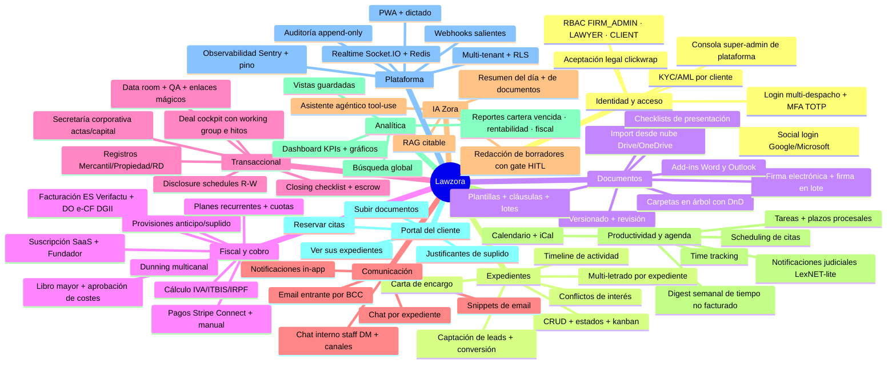

# 08 · Catálogo de funcionalidades

[⬅ Volver al índice](README.md)

Mapa de capacidades del producto. Cada rama corresponde a uno o varios módulos del API ([ver mapa](02-modulos-y-arquitectura.md)) y rutas de la web.

---

## 8.1 Mapa mental del producto

---

## 8.2 Madurez por área

| Área                                     | Estado         | Notas                                                                |
| ---------------------------------------- | -------------- | -------------------------------------------------------------------- |
| Expedientes / documentos / tareas        | ✅ Producción  | Núcleo maduro                                                        |
| Facturación ES/DO (cálculo + encadenado) | ✅ Producción  | Conformidad fiscal con golden-files                                  |
| Transmisión fiscal (AEAT / DGII)         | 🟡 Gated       | Motor end-to-end listo; falta **certificado real** del owner         |
| Cobro online                             | 🟡 Parcial     | Stripe Connect ES; RD en stub (manual)                               |
| IA agéntica                              | 🟡 Gated       | Listo; activar con `ANTHROPIC_API_KEY` (+ `VOYAGE_API_KEY` para RAG) |
| Firma electrónica                        | 🟡 Stub        | Signaturit con webhook HMAC; integración real pendiente              |
| Transaccional (deal/data room/closing)   | ✅ Producción  | Sembrar más escenarios demo                                          |
| Mensajería / realtime                    | ✅ Producción  | Multi-instancia requiere `REDIS_URL`                                 |
| Integraciones nube (Google/MS)           | ✅ Desplegado  | Usuarios reconectan en Ajustes                                       |
| Notificaciones judiciales                | 🟡 LexNET-lite | Acreditación LexNET pendiente (owner)                                |

Leyenda: ✅ en producción · 🟡 implementado pero requiere acción de owner / config para activar plenamente.
