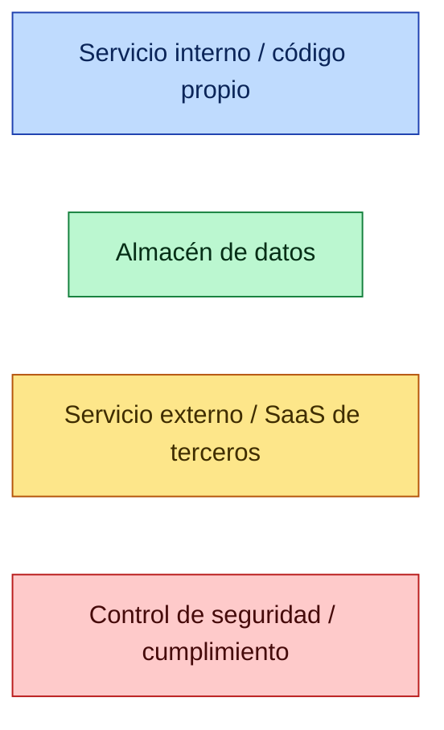

# Diagramas de Arquitectura — Lawzora / LegalFlow

> Set completo de diagramas (funcionalidades · flujos · arquitectura · infraestructura).
> Generado el **2026-06-29** a partir del código real (apps/api, apps/web, packages/*, IaC).
> Formato: **Markdown + [Mermaid](https://mermaid.js.org/)** — se renderiza en GitHub, VS Code (extensión *Markdown Preview Mermaid\*) y JetBrains.
>
> 🖼️ **Versión renderizada (offline):** abre [`index.html`](index.html) para navegar los 29 diagramas como imágenes (SVG en [`assets/`](assets/), generados con `mermaid-cli`). Para regenerar tras editar un `.md`, vuelve a renderizar los bloques a `assets/*.svg`.

---

## Cómo leer este set

Cada archivo agrupa diagramas por nivel de zoom, de lo macro a lo micro:

| #   | Archivo                                                       | Contenido                                                                                                                              | Tipo de diagrama     |
| --- | ------------------------------------------------------------- | -------------------------------------------------------------------------------------------------------------------------------------- | -------------------- |
| 01  | [Contexto y topología](01-contexto-y-topologia.md)            | Sistema en su entorno (actores + sistemas externos) y topología de despliegue (Fly.io, Neon, R2, Redis, Cloudflare)                    | C4-L1 · Deployment   |
| 02  | [Módulos y arquitectura](02-modulos-y-arquitectura.md)        | Monorepo, 60 módulos del API agrupados por dominio, paquetes compartidos, y ciclo de vida de una petición (guards/interceptores + RLS) | C4-L2/L3 · Sequence  |
| 03  | [Modelo de datos (ERD)](03-modelo-datos.md)                   | 82 modelos Prisma en ERDs por dominio, entidades-eje y multitenancy                                                                    | ER                   |
| 04  | [Flujos de negocio](04-flujos-negocio.md)                     | Auth/sesión, documentos+firma, deal/closing/data-room, mensajería realtime                                                             | Sequence · Flowchart |
| 05  | [Flujos fiscales](05-flujos-fiscales.md)                      | Patrón proveedor (ES/DO), e-CF DGII (RD) y Verifactu (ES), facturación/suscripción/dunning/Stripe                                      | Sequence · Flowchart |
| 06  | [IA agéntica](06-ia-agentica.md)                              | Bucle tool-use, catálogo de tools, gate HITL, RAG y cuotas                                                                             | Sequence · Flowchart |
| 07  | [CI/CD y seguridad](07-cicd-y-seguridad.md)                   | Pipeline GitHub Actions, gates obligatorios, conformidad fiscal, agentes IA de CI                                                      | Flowchart            |
| 08  | [Catálogo de funcionalidades](08-catalogo-funcionalidades.md) | Mapa mental de todas las capacidades del producto por área                                                                             | Mindmap              |

---

## Leyenda transversal

- **Núcleo (azul):** nuestro código (NestJS, Next.js, paquetes del monorepo).
- **Datos (verde):** Postgres/Neon, Redis, almacenamiento de objetos R2, índices.
- **Externo (ámbar):** SaaS de terceros (Stripe, Anthropic, Brevo, DGII, AEAT…).
- **Seguridad (rojo):** RLS, gates (suscripción, aceptación legal), cifrado, auditoría.

---

## Resumen ejecutivo del sistema

**Lawzora** es un SaaS de gestión legal **multi-tenant** y **multi-jurisdicción (España + República Dominicana)** para despachos de abogados. Núcleo agnóstico + adaptadores de cumplimiento por país.

| Dimensión                 | Cifra                                                    |
| ------------------------- | -------------------------------------------------------- |
| Módulos backend (NestJS)  | **60**                                                   |
| Modelos de datos (Prisma) | **82**                                                   |
| Dominios funcionales      | **16**                                                   |
| Jurisdicciones fiscales   | **2** (ES Verifactu · DO e-CF DGII)                      |
| Tipos de cuenta           | **3** (FIRM · PROFESSIONAL · CONSUMER)                   |
| Roles base                | FIRM_ADMIN · LAWYER · CLIENT + super-admin de plataforma |
| Tools del agente IA       | read + write (gate HITL, sin acciones fiscales)          |

**Stack:** TypeScript · NestJS · Next.js 15 (App Router) · Prisma · PostgreSQL (Neon, RLS) · Redis · Socket.IO · Cloudflare R2 · Stripe · Anthropic Claude · Voyage AI · Fly.io (Frankfurt) · GitHub Actions.
